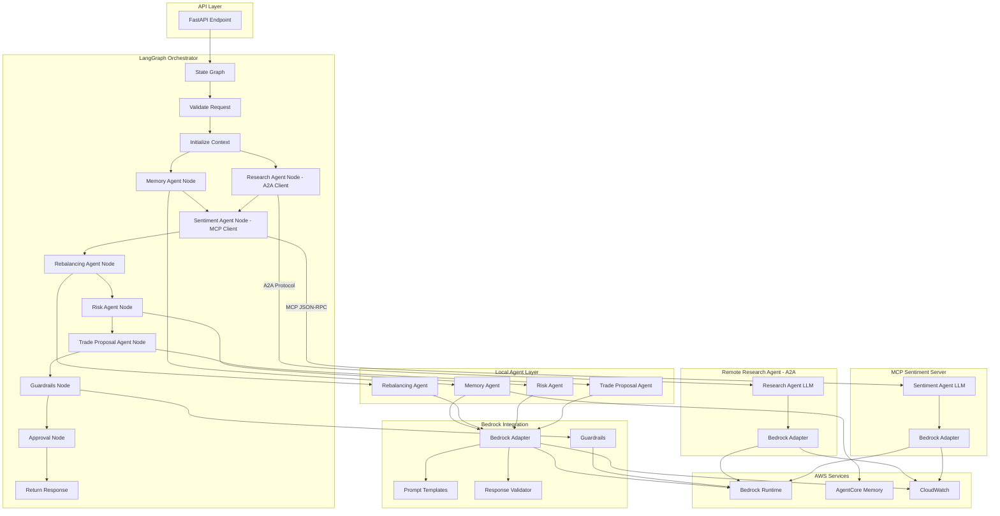

# Design Document: LLM-LangGraph Integration

## Overview

This design transforms the current hardcoded multi-agent portfolio management system into a production-quality LangGraph-based agentic AI solution with AWS Bedrock LLM integration. The system currently uses sequential function calls with deterministic logic and stub adapters. The target architecture introduces:

- **LangGraph State Machine**: Explicit workflow orchestration with typed state, conditional routing, and error boundaries
- **Bedrock Model Adapter**: Production-ready LLM integration with retry logic, timeout controls, and structured output validation
- **Intelligent Agents**: Six specialist agents enhanced with LLM reasoning:
  - **Memory Agent** (local): LLM-powered semantic queries and context synthesis
  - **Research Agent** (remote A2A): Market research synthesis via Agent-to-Agent protocol
  - **Sentiment Agent** (MCP server): News sentiment analysis via Model Context Protocol
  - **Rebalancing Agent** (local): Portfolio drift explanations with LLM reasoning
  - **Risk Agent** (local): Natural language policy verdicts with LLM explanations
  - **Trade Proposal Agent** (local): Detailed trade proposals with LLM-backed rationale
- **Multi-Protocol Support**: Local execution, A2A (Agent-to-Agent), and MCP (Model Context Protocol) for flexible agent deployment
- **Prompt Template System**: Versioned, validated templates with few-shot examples and grounding instructions
- **Observability Layer**: Comprehensive tracing for LLM invocations with cost tracking and performance monitoring
- **Resilience Patterns**: Graceful fallback to deterministic behavior when LLM services are unavailable

The design maintains existing API contracts while introducing LLM-powered natural language explanations, contextual analysis, and intelligent reasoning throughout the workflow. The multi-protocol architecture allows independent scaling and deployment of compute-intensive agents (Research via A2A) and reusable tool services (Sentiment via MCP).

## Architecture

### High-Level Architecture



### LangGraph State Graph Design

The state graph implements a directed acyclic graph (DAG) with conditional edges for policy-based routing. Key design principles ([source](https://www.swarnendu.de/blog/langgraph-best-practices/)):

1. **Clear State Management**: Typed state object with correlation metadata, agent outputs, and quality indicators
2. **Controllable Flow**: Explicit nodes and edges with conditional routing based on policy verdicts
3. **Error Boundaries**: Structured error handling at node level with graceful degradation
4. **Operational Visibility**: Trace spans emitted at every node for debugging and monitoring
5. **Protocol Abstraction**: Support for local, A2A (Agent-to-Agent), and MCP (Model Context Protocol) agent execution

#### Agent Execution Protocols

The system supports three agent execution protocols:

1. **Local Execution**: Agent runs in-process within LangGraph orchestrator
   - Used for: Memory, Rebalancing, Risk, Trade Proposal agents
   - Benefits: Low latency, no network overhead, simplified deployment
   
2. **A2A (Agent-to-Agent) Protocol**: Agent runs as remote HTTP service
   - Used for: Research Agent
   - Benefits: Independent scaling, language-agnostic, can run on specialized infrastructure
   - Communication: HTTP POST with JSON request/response envelopes
   
3. **MCP (Model Context Protocol)**: Agent runs as MCP tool server
   - Used for: Sentiment Analysis Agent
   - Benefits: Standardized tool interface, composable with other MCP clients, reusable across systems
   - Communication: JSON-RPC 2.0 over HTTP

**Protocol Selection Rationale:**

- **Research Agent as A2A**: Research requires high-quality LLM synthesis (Claude 3.5 Sonnet) and may benefit from dedicated compute resources. A2A allows independent scaling and deployment.
- **Sentiment Agent as MCP**: Sentiment analysis is a well-defined tool operation that can be reused across multiple systems. MCP provides a standardized interface for tool invocation.
- **Other Agents as Local**: Memory, Rebalancing, Risk, and Trade Proposal agents are tightly coupled to the workflow state and benefit from low-latency local execution.

#### State Schema

```python
class WorkflowGraphState(TypedDict):
    # Correlation and versioning
    request_id: str
    session_id: str
    trace_id: str
    schema_version: str
    agent_version_set: str
    policy_version: str
    environment: str
    
    # Tracing
    trace_provider: str  # "bedrock_agentcore" | "langsmith"
    provider_trace_url: Optional[str]
    
    # Input
    request: PortfolioRebalanceRequest
    user_role_context: dict
    
    # Agent outputs
    memory_output: Optional[dict]
    research_output: Optional[dict]
    sentiment_output: Optional[dict]
    rebalancing_output: Optional[dict]
    risk_policy_output: Optional[RiskPolicyResponse]
    trade_proposal_output: Optional[ExecutionProposalResponse]
    guardrail_result: Optional[dict]
    approval_artifact: Optional[ApprovalArtifact]
    
    # Quality indicators
    confidence_map: dict[str, float]
    degraded_reasons: list[str]
    blockers: list[str]
    
    # Final output
    recommendation_package: Optional[RecommendationPackage]
    workflow_state: WorkflowState
    audit_event_ids: list[str]
```

#### Node Definitions

**Validation and Initialization Nodes:**
- `validate_request`: Schema validation, authentication checks
- `initialize_context_and_trace`: Trace provider setup, correlation ID generation
- `log_request_audit_event`: Audit event emission with correlation metadata

**Agent Execution Nodes:**
- `hydrate_memory`: Memory retrieval with LLM-powered semantic queries (local)
- `run_research`: Market research synthesis via remote A2A agent with LLM contextual analysis
- `run_sentiment_analysis`: News sentiment analysis via MCP server with LLM reasoning
- `run_portfolio_rebalancing`: Drift calculation with LLM explanations (local)
- `run_risk_policy`: Policy evaluation with LLM natural language verdicts (local)
- `generate_execution_proposal`: Trade proposal generation with LLM rationale (local)

**Output Processing Nodes:**
- `apply_output_guardrails`: Bedrock guardrails for grounding and safety checks
- `assemble_recommendation`: Merge agent outputs into recommendation package
- `create_approval_artifact`: Generate approval workflow artifact
- `persist_workflow_artifacts`: DynamoDB persistence
- `enqueue_memory_consolidation_candidates`: Memory lifecycle management
- `emit_workflow_audit_event`: Final audit event emission
- `return_response`: Response serialization and return

#### Conditional Edges

```python
def route_after_validation(state: WorkflowGraphState) -> str:
    """Route based on validation result."""
    if state.get("validation_error"):
        return "emit_workflow_audit_event"
    return "initialize_context_and_trace"

def route_after_risk_policy(state: WorkflowGraphState) -> str:
    """Route based on policy verdict."""
    policy = state.get("risk_policy_output")
    if policy and policy.verdict in [PolicyVerdictStatus.NON_COMPLIANT, PolicyVerdictStatus.UNRESOLVED]:
        state["workflow_state"] = WorkflowState.BLOCKED
        state["blockers"].append("Policy verdict blocks trade proposal")
        return "assemble_recommendation"
    return "generate_execution_proposal"

def route_after_guardrails(state: WorkflowGraphState) -> str:
    """Route based on guardrail result."""
    guardrail = state.get("guardrail_result")
    if guardrail and guardrail.get("action") == "BLOCKED":
        state["workflow_state"] = WorkflowState.BLOCKED
        state["blockers"].append("GUARDRAIL_VIOLATION")
        return "emit_workflow_audit_event"
    return "create_approval_artifact"
```

#### Parallel Execution

Memory retrieval and research can execute in parallel as they have no dependencies:

```python
# Define parallel fan-out after initialization
graph.add_edge("log_request_audit_event", "hydrate_memory")
graph.add_edge("log_request_audit_event", "run_research")

# Both must complete before sentiment analysis
graph.add_edge("hydrate_memory", "run_sentiment_analysis")
graph.add_edge("run_research", "run_sentiment_analysis")
```

### Bedrock Integration Architecture

The Bedrock adapter provides a unified interface for LLM invocations with production-grade reliability patterns ([source](https://www.repost.aws/knowledge-center/bedrock-retry-exponential-backoff-api)):

#### Retry Strategy

```python
class RetryConfig:
    max_retries: int = 4
    base_delay: float = 1.0  # seconds
    max_delay: float = 60.0  # seconds
    exponential_base: float = 2.0
    jitter: bool = True
    
    # Retryable errors
    retryable_exceptions = [
        "ThrottlingException",
        "ModelTimeoutException", 
        "ServiceUnavailableException",
        "InternalServerException",
        "ConnectionError",
        "Timeout"
    ]
    
    # Non-retryable errors
    non_retryable_exceptions = [
        "ValidationException",
        "AccessDeniedException",
        "ResourceNotFoundException"
    ]
```

#### Timeout Configuration

Based on model characteristics and expected response times ([source](https://learn.cloudbuckle.com/docs/claude-optimization/common-pitfalls)):

- **Standard requests**: 60 seconds
- **Extended thinking**: 300-600 seconds
- **Streaming responses**: 120 seconds with chunk timeout of 30 seconds

#### Model Selection

Support multiple foundation models through configuration:

```python
class ModelConfig:
    # Claude models
    CLAUDE_3_SONNET = "anthropic.claude-3-sonnet-20240229-v1:0"
    CLAUDE_3_HAIKU = "anthropic.claude-3-haiku-20240307-v1:0"
    CLAUDE_3_5_SONNET = "anthropic.claude-3-5-sonnet-20240620-v1:0"
    
    # Titan models
    TITAN_TEXT_EXPRESS = "amazon.titan-text-express-v1"
    TITAN_TEXT_LITE = "amazon.titan-text-lite-v1"
    
    # Agent-specific model mapping
    agent_models = {
        "memory": CLAUDE_3_HAIKU,  # Fast, cost-effective
        "research": CLAUDE_3_5_SONNET,  # High-quality synthesis
        "sentiment": CLAUDE_3_HAIKU,  # Fast sentiment classification
        "rebalancing": CLAUDE_3_SONNET,  # Balanced quality/cost
        "risk": CLAUDE_3_5_SONNET,  # Critical policy decisions
        "trade_proposal": CLAUDE_3_5_SONNET  # High-stakes recommendations
    }
```

## Components and Interfaces

### Bedrock Model Adapter

The adapter provides a clean abstraction over Bedrock APIs with comprehensive error handling:

```python
class BedrockModelAdapter:
    """Production-ready Bedrock adapter with retry logic and validation."""
    
    def __init__(
        self,
        bedrock_client: boto3.client,
        retry_config: RetryConfig,
        timeout_config: TimeoutConfig,
        trace_provider: TraceProvider
    ):
        self.client = bedrock_client
        self.retry_config = retry_config
        self.timeout_config = timeout_config
        self.trace_provider = trace_provider
    
    async def invoke_model(
        self,
        model_id: str,
        prompt: str,
        system_prompt: Optional[str] = None,
        temperature: float = 0.7,
        max_tokens: int = 2048,
        stop_sequences: Optional[list[str]] = None,
        metadata: Optional[dict] = None
    ) -> ModelResponse:
        """
        Invoke Bedrock model with retry logic and validation.
        
        Returns:
            ModelResponse with content, token usage, and metadata
            
        Raises:
            ModelInvocationError: For non-retryable errors
            ModelTimeoutError: When timeout is exceeded
            ModelValidationError: When response validation fails
        """
        
    async def invoke_model_streaming(
        self,
        model_id: str,
        prompt: str,
        system_prompt: Optional[str] = None,
        temperature: float = 0.7,
        max_tokens: int = 2048,
        chunk_callback: Optional[Callable[[str], None]] = None,
        metadata: Optional[dict] = None
    ) -> AsyncIterator[str]:
        """
        Invoke Bedrock model with streaming response.
        
        Yields:
            Response chunks as they arrive
        """
    
    async def validate_response(
        self,
        response: ModelResponse,
        expected_schema: Optional[Type[BaseModel]] = None,
        grounding_sources: Optional[list[dict]] = None
    ) -> ValidationResult:
        """
        Validate LLM response against schema and grounding sources.
        
        Returns:
            ValidationResult with pass/fail status and violations
        """
```

### Prompt Template System

Structured templates with versioning and validation ([source](https://www.getmaxim.ai/articles/a-practitioners-guide-to-prompt-engineering-in-2025/)):

```python
class PromptTemplate:
    """Versioned prompt template with validation."""
    
    template_id: str
    version: str
    agent_name: str
    system_prompt: str
    user_prompt_template: str
    few_shot_examples: list[dict]
    output_schema: Type[BaseModel]
    grounding_instructions: str
    confidence_instructions: str
    
    def render(self, inputs: dict) -> RenderedPrompt:
        """
        Render template with inputs and validation.
        
        Validates inputs against template schema to prevent injection.
        Returns rendered system and user prompts.
        """
    
    def validate_inputs(self, inputs: dict) -> ValidationResult:
        """Validate inputs against template schema."""
    
    @classmethod
    def load_from_registry(cls, template_id: str, version: str) -> "PromptTemplate":
        """Load template from registry with version control."""
```

#### Template Structure

Each agent has a structured template following best practices:

```python
# Example: Research Agent Template
RESEARCH_AGENT_TEMPLATE = PromptTemplate(
    template_id="research-agent-v1",
    version="1.0.0",
    agent_name="Research Agent",
    system_prompt="""You are a financial research analyst specializing in portfolio management.
Your role is to synthesize market research and provide contextual analysis for investment decisions.

CRITICAL REQUIREMENTS:
1. Cite all sources with specific references
2. Distinguish facts from interpretation
3. Provide confidence levels (HIGH, MEDIUM, LOW) for all claims
4. Identify gaps in available data
5. Use structured JSON output format

OUTPUT FORMAT:
{
  "market_context": "string",
  "key_insights": ["string"],
  "confidence": "HIGH|MEDIUM|LOW",
  "evidence": [{"source": "string", "claim": "string", "quote": "string"}],
  "data_gaps": ["string"]
}""",
    user_prompt_template="""Analyze the following portfolio holdings and provide market context:

HOLDINGS:
{holdings_json}

MARKET DATA:
{market_data_json}

Provide a comprehensive market context summary with evidence citations.""",
    few_shot_examples=[
        {
            "input": {"holdings_json": "[{\"symbol\": \"AAPL\", \"quantity\": 100}]", "market_data_json": "{...}"},
            "output": {
                "market_context": "Technology sector showing strong momentum...",
                "key_insights": ["AAPL benefiting from AI product cycle"],
                "confidence": "HIGH",
                "evidence": [{"source": "Q4 earnings report", "claim": "Revenue up 12%", "quote": "..."}],
                "data_gaps": []
            }
        }
    ],
    output_schema=ResearchAgentOutput,
    grounding_instructions="All claims must be supported by evidence from provided market data or holdings.",
    confidence_instructions="Assign HIGH confidence only when multiple sources confirm the claim."
)
```

### Agent LLM Integration Patterns

Each agent follows a consistent pattern for LLM integration:

```python
class LLMEnhancedAgent:
    """Base pattern for LLM-enhanced agents."""
    
    def __init__(
        self,
        model_adapter: BedrockModelAdapter,
        prompt_template: PromptTemplate,
        fallback_handler: FallbackHandler,
        trace_provider: TraceProvider
    ):
        self.model_adapter = model_adapter
        self.prompt_template = prompt_template
        self.fallback_handler = fallback_handler
        self.trace_provider = trace_provider
    
    async def run(self, inputs: dict) -> tuple[AgentStageResult, dict]:
        """
        Execute agent with LLM integration and fallback.
        
        Pattern:
        1. Validate inputs
        2. Render prompt template
        3. Invoke LLM with retry logic
        4. Validate response
        5. Fall back to deterministic logic on failure
        6. Emit trace spans
        7. Return structured result
        """
        span = self.trace_provider.start_span(f"{self.agent_name}_execution")
        
        try:
            # Validate inputs
            validation = self.prompt_template.validate_inputs(inputs)
            if not validation.is_valid:
                raise ValidationError(validation.errors)
            
            # Render prompt
            rendered = self.prompt_template.render(inputs)
            
            # Invoke LLM
            llm_span = self.trace_provider.start_span(f"{self.agent_name}_llm_invocation")
            try:
                response = await self.model_adapter.invoke_model(
                    model_id=self.get_model_id(),
                    prompt=rendered.user_prompt,
                    system_prompt=rendered.system_prompt,
                    metadata={"agent": self.agent_name, "template_version": self.prompt_template.version}
                )
                llm_span.set_attributes({
                    "model_id": self.get_model_id(),
                    "prompt_hash": hash(rendered.user_prompt),
                    "input_tokens": response.usage.input_tokens,
                    "output_tokens": response.usage.output_tokens,
                    "latency_ms": response.latency_ms
                })
            finally:
                llm_span.end()
            
            # Validate response
            validation_result = await self.model_adapter.validate_response(
                response,
                expected_schema=self.prompt_template.output_schema,
                grounding_sources=self.extract_grounding_sources(inputs)
            )
            
            if not validation_result.is_valid:
                self.trace_provider.log_event("validation_failed", validation_result.violations)
                raise ValidationError(validation_result.violations)
            
            # Parse and return
            parsed_output = self.parse_llm_output(response.content)
            stage_result = completed_stage(
                self.agent_name,
                parsed_output.get("summary", "LLM-generated analysis completed"),
                protocol="BEDROCK_LLM",
                execution_location="bedrock"
            )
            
            return stage_result, parsed_output
            
        except (ModelInvocationError, ModelTimeoutError, ValidationError) as e:
            # Fall back to deterministic logic
            self.trace_provider.log_event("fallback_activated", {"reason": str(e)})
            return await self.fallback_handler.execute(inputs)
            
        finally:
            span.end()
```

### Response Validation and Grounding

Comprehensive validation ensures LLM outputs are reliable and grounded:

```python
class ResponseValidator:
    """Validates LLM responses for schema compliance and grounding."""
    
    async def validate(
        self,
        response: ModelResponse,
        expected_schema: Optional[Type[BaseModel]] = None,
        grounding_sources: Optional[list[dict]] = None,
        confidence_threshold: float = 0.7
    ) -> ValidationResult:
        """
        Multi-stage validation:
        1. Schema validation (Pydantic)
        2. Grounding validation (evidence citations)
        3. Confidence validation (threshold checks)
        4. Bedrock guardrails (safety, policy)
        """
        violations = []
        
        # Schema validation
        if expected_schema:
            try:
                parsed = expected_schema.model_validate_json(response.content)
            except ValidationError as e:
                violations.append({"type": "schema", "errors": e.errors()})
        
        # Grounding validation
        if grounding_sources:
            grounding_result = self.check_grounding(response.content, grounding_sources)
            if not grounding_result.is_grounded:
                violations.append({"type": "grounding", "ungrounded_claims": grounding_result.ungrounded_claims})
        
        # Confidence validation
        confidence = self.extract_confidence(response.content)
        if confidence and confidence < confidence_threshold:
            violations.append({"type": "confidence", "value": confidence, "threshold": confidence_threshold})
        
        return ValidationResult(
            is_valid=len(violations) == 0,
            violations=violations,
            confidence=confidence
        )
    
    def check_grounding(self, content: str, sources: list[dict]) -> GroundingResult:
        """
        Check if claims in content are supported by sources.
        
        Uses Bedrock guardrails grounding check API.
        """
    
    def extract_confidence(self, content: str) -> Optional[float]:
        """Extract confidence score from LLM output."""
```


### Agent-Specific LLM Integration

#### Memory Agent

```python
class MemoryAgentLLM(LLMEnhancedAgent):
    """Memory agent with LLM-powered semantic queries and synthesis."""
    
    async def generate_semantic_query(self, request_context: dict) -> str:
        """Use LLM to generate semantic query from request context."""
        prompt = self.prompt_template.render({
            "client_id": request_context["client_id"],
            "request_type": request_context["request_type"],
            "portfolio_context": request_context["portfolio_snapshot"]
        })
        
        response = await self.model_adapter.invoke_model(
            model_id=ModelConfig.CLAUDE_3_HAIKU,  # Fast, cost-effective
            prompt=prompt.user_prompt,
            system_prompt=prompt.system_prompt,
            max_tokens=512
        )
        
        return response.content
    
    async def synthesize_memory_items(self, memory_items: list[dict]) -> dict:
        """Use LLM to synthesize retrieved memory into coherent context."""
        prompt = self.prompt_template.render({
            "memory_items": memory_items,
            "synthesis_instructions": "Create coherent client context summary"
        })
        
        response = await self.model_adapter.invoke_model(
            model_id=ModelConfig.CLAUDE_3_HAIKU,
            prompt=prompt.user_prompt,
            system_prompt=prompt.system_prompt,
            max_tokens=1024
        )
        
        return self.parse_llm_output(response.content)
    
    async def detect_conflicts(self, memory_items: list[dict], current_request: dict) -> list[dict]:
        """Use LLM to identify conflicts between memory and current request."""
        prompt = self.prompt_template.render({
            "memory_items": memory_items,
            "current_request": current_request
        })
        
        response = await self.model_adapter.invoke_model(
            model_id=ModelConfig.CLAUDE_3_HAIKU,
            prompt=prompt.user_prompt,
            system_prompt=prompt.system_prompt,
            max_tokens=512
        )
        
        return self.parse_llm_output(response.content).get("conflicts", [])
```

#### Research Agent (Remote A2A)

The Research Agent runs as a remote service and communicates via A2A (Agent-to-Agent) protocol:

```python
class ResearchAgentA2AClient:
    """Client for remote Research Agent using A2A protocol."""
    
    def __init__(
        self,
        research_agent_url: str,
        timeout_seconds: int = 60,
        trace_provider: TraceProvider
    ):
        self.research_agent_url = research_agent_url
        self.timeout_seconds = timeout_seconds
        self.trace_provider = trace_provider
    
    async def run(self, request: PortfolioRebalanceRequest) -> tuple[AgentStageResult, dict]:
        """Invoke remote Research Agent via A2A protocol."""
        span = self.trace_provider.start_span("research_agent_a2a_invocation")
        
        try:
            # Prepare A2A envelope
            a2a_request = {
                "task": "portfolio_research",
                "request_id": request.correlation.request_id,
                "symbols": [holding.symbol for holding in request.portfolio_snapshot.holdings],
                "portfolio_request": request.model_dump(mode="json"),
                "llm_config": {
                    "model_id": ModelConfig.CLAUDE_3_5_SONNET,
                    "temperature": 0.3,
                    "max_tokens": 2048
                }
            }
            
            # Invoke remote agent
            async with httpx.AsyncClient(timeout=self.timeout_seconds) as client:
                response = await client.post(
                    self.research_agent_url,
                    json=a2a_request,
                    headers={"Content-Type": "application/json"}
                )
                response.raise_for_status()
                body = response.json()
            
            # Extract payload from A2A response
            payload = body.get("payload", {})
            
            # Create stage result
            stage = completed_stage(
                "Research Agent",
                body.get("summary", "Remote research agent returned market context."),
                protocol="A2A",
                execution_location="remote"
            )
            
            span.set_attributes({
                "protocol": "A2A",
                "remote_url": self.research_agent_url,
                "response_status": response.status_code,
                "latency_ms": response.elapsed.total_seconds() * 1000
            })
            
            return stage, payload
            
        except httpx.HTTPError as e:
            self.trace_provider.log_event("research_agent_a2a_failed", {
                "error": str(e),
                "falling_back": True
            })
            # Fall back to local implementation
            return await self.fallback_local(request)
        finally:
            span.end()
    
    async def fallback_local(self, request: PortfolioRebalanceRequest) -> tuple[AgentStageResult, dict]:
        """Fallback to local deterministic behavior."""
        holdings = request.portfolio_snapshot.holdings
        symbols = ", ".join(holding.symbol for holding in holdings)
        payload = {
            "symbols": [holding.symbol for holding in holdings],
            "summary": f"Using request-provided market values for {symbols}.",
            "source": "request_payload"
        }
        stage = completed_stage(
            "Research Agent",
            "Prepared local fallback market context from request holdings.",
            protocol="LOCAL",
            execution_location="in_process_fallback"
        )
        return stage, payload
```

**Remote Research Agent Implementation** (runs as separate service):

```python
# remote-agents/research-agent/main.py
from fastapi import FastAPI, HTTPException
from pydantic import BaseModel

app = FastAPI()

class A2AResearchRequest(BaseModel):
    """A2A request for research agent."""
    task: str
    request_id: str
    symbols: list[str]
    portfolio_request: dict
    llm_config: dict

class A2AResearchResponse(BaseModel):
    """A2A response from research agent."""
    summary: str
    payload: dict
    protocol: str = "A2A"
    execution_location: str = "remote"

@app.post("/research", response_model=A2AResearchResponse)
async def research_endpoint(request: A2AResearchRequest):
    """A2A endpoint for research agent."""
    # Initialize LLM-enhanced research agent
    research_agent = ResearchAgentLLM(
        model_adapter=bedrock_adapter,
        prompt_template=research_template,
        trace_provider=trace_provider
    )
    
    # Execute research with LLM
    result = await research_agent.synthesize_market_context(
        holdings=request.portfolio_request["portfolio_snapshot"]["holdings"],
        market_data={}  # Fetch from market data service
    )
    
    return A2AResearchResponse(
        summary=result.get("market_context", "Market research completed"),
        payload=result
    )
```

#### Sentiment Agent (MCP Server)

The Sentiment Agent runs as an MCP (Model Context Protocol) server and communicates via JSON-RPC:

```python
class SentimentAgentMCPClient:
    """Client for Sentiment Agent MCP server."""
    
    def __init__(
        self,
        mcp_server_url: str,
        timeout_seconds: int = 60,
        trace_provider: TraceProvider
    ):
        self.mcp_server_url = mcp_server_url
        self.timeout_seconds = timeout_seconds
        self.trace_provider = trace_provider
    
    async def run(self, symbols: list[str]) -> tuple[AgentStageResult, dict]:
        """Invoke Sentiment Agent via MCP protocol."""
        span = self.trace_provider.start_span("sentiment_agent_mcp_invocation")
        
        try:
            # Prepare MCP JSON-RPC request
            mcp_request = {
                "jsonrpc": "2.0",
                "id": f"sentiment-{uuid.uuid4()}",
                "method": "tools/call",
                "params": {
                    "name": "analyze_symbol_news_sentiment",
                    "arguments": {
                        "symbols": symbols,
                        "llm_config": {
                            "model_id": ModelConfig.CLAUDE_3_HAIKU,
                            "temperature": 0.5,
                            "max_tokens": 1024
                        }
                    }
                }
            }
            
            # Invoke MCP server
            async with httpx.AsyncClient(timeout=self.timeout_seconds) as client:
                response = await client.post(
                    self.mcp_server_url,
                    json=mcp_request,
                    headers={"Content-Type": "application/json"}
                )
                response.raise_for_status()
                body = response.json()
            
            # Extract result from MCP response
            if "error" in body:
                raise MCPError(f"MCP error: {body['error']}")
            
            result = body.get("result", {})
            
            # Create stage result
            stage = completed_stage(
                "Sentiment Analysis Agent",
                result.get("summary", "MCP sentiment tool returned sentiment signals."),
                protocol="MCP",
                execution_location="mcp_server"
            )
            
            span.set_attributes({
                "protocol": "MCP",
                "mcp_server_url": self.mcp_server_url,
                "tool_name": "analyze_symbol_news_sentiment",
                "response_status": response.status_code,
                "latency_ms": response.elapsed.total_seconds() * 1000
            })
            
            return stage, result
            
        except (httpx.HTTPError, MCPError) as e:
            self.trace_provider.log_event("sentiment_agent_mcp_failed", {
                "error": str(e),
                "falling_back": True
            })
            # Fall back to local implementation
            return await self.fallback_local(symbols)
        finally:
            span.end()
    
    async def fallback_local(self, symbols: list[str]) -> tuple[AgentStageResult, dict]:
        """Fallback to local deterministic behavior."""
        payload = {
            "symbols": symbols,
            "sentiment": "NEUTRAL",
            "summary": "No live news feed is configured yet; sentiment defaults to neutral.",
        }
        return (
            completed_stage(
                "Sentiment Analysis Agent",
                "Generated neutral fallback sentiment.",
                protocol="LOCAL",
                execution_location="in_process_fallback",
            ),
            payload,
        )
```

**MCP Sentiment Server Implementation** (runs as separate MCP server):

```python
# mcp-servers/sentiment/server.py
from mcp.server import Server
from mcp.types import Tool, TextContent

app = Server("sentiment-analysis-mcp")

@app.list_tools()
async def list_tools() -> list[Tool]:
    """List available MCP tools."""
    return [
        Tool(
            name="analyze_symbol_news_sentiment",
            description="Analyze news sentiment for given stock symbols using LLM",
            inputSchema={
                "type": "object",
                "properties": {
                    "symbols": {
                        "type": "array",
                        "items": {"type": "string"},
                        "description": "Stock symbols to analyze"
                    },
                    "llm_config": {
                        "type": "object",
                        "description": "LLM configuration for sentiment analysis"
                    }
                },
                "required": ["symbols"]
            }
        )
    ]

@app.call_tool()
async def call_tool(name: str, arguments: dict) -> list[TextContent]:
    """Handle MCP tool invocation."""
    if name == "analyze_symbol_news_sentiment":
        symbols = arguments["symbols"]
        llm_config = arguments.get("llm_config", {})
        
        # Initialize LLM-enhanced sentiment agent
        sentiment_agent = SentimentAgentLLM(
            model_adapter=bedrock_adapter,
            prompt_template=sentiment_template,
            trace_provider=trace_provider
        )
        
        # Fetch news articles for symbols
        news_articles = await fetch_news_for_symbols(symbols)
        
        # Analyze sentiment with LLM
        result = await sentiment_agent.analyze_news_sentiment(
            news_articles=news_articles,
            symbols=symbols
        )
        
        return [
            TextContent(
                type="text",
                text=json.dumps({
                    "summary": f"Analyzed sentiment for {len(symbols)} symbols",
                    "overall_sentiment": result.get("overall_sentiment"),
                    "symbol_sentiments": result.get("symbol_sentiments"),
                    "key_themes": result.get("key_themes"),
                    "evidence": result.get("evidence")
                })
            )
        ]
    
    raise ValueError(f"Unknown tool: {name}")
```

#### Rebalancing Agent

```python
class RebalancingAgentLLM(LLMEnhancedAgent):
    """Rebalancing agent with LLM-powered drift explanations."""
    
    async def explain_drift(self, drift_items: list[DriftItem], risk_profile: dict) -> str:
        """Generate natural language explanation of allocation drift."""
        prompt = self.prompt_template.render({
            "drift_items": [item.model_dump() for item in drift_items],
            "risk_profile": risk_profile
        })
        
        response = await self.model_adapter.invoke_model(
            model_id=ModelConfig.CLAUDE_3_SONNET,
            prompt=prompt.user_prompt,
            system_prompt=prompt.system_prompt,
            max_tokens=1024,
            temperature=0.4
        )
        
        return response.content
    
    async def recommend_strategy(
        self,
        drift_items: list[DriftItem],
        market_context: dict,
        risk_profile: dict
    ) -> dict:
        """Recommend rebalancing strategy based on drift and market context."""
        prompt = self.prompt_template.render({
            "drift_items": [item.model_dump() for item in drift_items],
            "market_context": market_context,
            "risk_profile": risk_profile
        })
        
        response = await self.model_adapter.invoke_model(
            model_id=ModelConfig.CLAUDE_3_SONNET,
            prompt=prompt.user_prompt,
            system_prompt=prompt.system_prompt,
            max_tokens=1536,
            temperature=0.5
        )
        
        # Validate recommendations against deterministic drift calculations
        output = self.parse_llm_output(response.content)
        self.validate_recommendations(output, drift_items)
        
        return output
    
    def validate_recommendations(self, llm_output: dict, drift_items: list[DriftItem]) -> None:
        """Ensure LLM recommendations align with deterministic drift calculations."""
        # Check that LLM identified all out-of-tolerance drifts
        out_of_tolerance = [item for item in drift_items if not item.within_tolerance]
        llm_identified = llm_output.get("out_of_tolerance_assets", [])
        
        if len(llm_identified) != len(out_of_tolerance):
            raise ValidationError("LLM missed out-of-tolerance drifts")
```

#### Risk Agent

```python
class RiskAgentLLM(LLMEnhancedAgent):
    """Risk agent with LLM-powered policy explanations."""
    
    async def explain_policy_verdict(
        self,
        verdict: PolicyVerdictStatus,
        policy_checks: list[dict],
        drift_items: list[DriftItem]
    ) -> str:
        """Generate natural language explanation of policy verdict."""
        prompt = self.prompt_template.render({
            "verdict": verdict.value,
            "policy_checks": policy_checks,
            "drift_items": [item.model_dump() for item in drift_items]
        })
        
        response = await self.model_adapter.invoke_model(
            model_id=ModelConfig.CLAUDE_3_5_SONNET,  # Critical policy decisions
            prompt=prompt.user_prompt,
            system_prompt=prompt.system_prompt,
            max_tokens=1536,
            temperature=0.3  # Lower temperature for policy explanations
        )
        
        return response.content
    
    async def recommend_corrective_actions(
        self,
        violations: list[dict],
        portfolio_snapshot: dict
    ) -> list[dict]:
        """Recommend corrective actions for policy violations."""
        prompt = self.prompt_template.render({
            "violations": violations,
            "portfolio_snapshot": portfolio_snapshot
        })
        
        response = await self.model_adapter.invoke_model(
            model_id=ModelConfig.CLAUDE_3_5_SONNET,
            prompt=prompt.user_prompt,
            system_prompt=prompt.system_prompt,
            max_tokens=1536
        )
        
        return self.parse_llm_output(response.content).get("corrective_actions", [])
```

#### Trade Proposal Agent

```python
class TradeProposalAgentLLM(LLMEnhancedAgent):
    """Trade proposal agent with LLM-powered rationale generation."""
    
    async def generate_proposal_rationale(
        self,
        trades: list[dict],
        policy_verdict: dict,
        market_context: dict
    ) -> str:
        """Generate detailed rationale for trade proposal."""
        prompt = self.prompt_template.render({
            "trades": trades,
            "policy_verdict": policy_verdict,
            "market_context": market_context
        })
        
        response = await self.model_adapter.invoke_model(
            model_id=ModelConfig.CLAUDE_3_5_SONNET,  # High-stakes recommendations
            prompt=prompt.user_prompt,
            system_prompt=prompt.system_prompt,
            max_tokens=2048,
            temperature=0.4
        )
        
        return response.content
    
    async def explain_estimated_impact(
        self,
        trades: list[dict],
        current_allocation: dict,
        target_allocation: dict
    ) -> dict:
        """Explain estimated impact on allocations, costs, and tax considerations."""
        prompt = self.prompt_template.render({
            "trades": trades,
            "current_allocation": current_allocation,
            "target_allocation": target_allocation
        })
        
        response = await self.model_adapter.invoke_model(
            model_id=ModelConfig.CLAUDE_3_5_SONNET,
            prompt=prompt.user_prompt,
            system_prompt=prompt.system_prompt,
            max_tokens=1536
        )
        
        output = self.parse_llm_output(response.content)
        
        # Validate estimated allocations are mathematically consistent
        self.validate_allocation_math(output, trades, current_allocation)
        
        return output
    
    def validate_allocation_math(
        self,
        llm_output: dict,
        trades: list[dict],
        current_allocation: dict
    ) -> None:
        """Ensure LLM allocation estimates are mathematically consistent."""
        # Deterministic calculation of post-trade allocation
        expected_allocation = self.calculate_post_trade_allocation(trades, current_allocation)
        llm_allocation = llm_output.get("estimated_allocation", {})
        
        # Check within tolerance (0.1% for rounding)
        for asset_class, expected_pct in expected_allocation.items():
            llm_pct = llm_allocation.get(asset_class, 0)
            if abs(expected_pct - llm_pct) > 0.001:
                raise ValidationError(f"LLM allocation math error for {asset_class}")
```

## Data Models

### LLM Request/Response Models

```python
from pydantic import BaseModel, Field
from typing import Optional, Literal

class ModelRequest(BaseModel):
    """Request to Bedrock model."""
    model_id: str
    prompt: str
    system_prompt: Optional[str] = None
    temperature: float = Field(default=0.7, ge=0.0, le=1.0)
    max_tokens: int = Field(default=2048, ge=1, le=4096)
    stop_sequences: Optional[list[str]] = None
    top_p: Optional[float] = Field(default=None, ge=0.0, le=1.0)
    top_k: Optional[int] = Field(default=None, ge=0)

class TokenUsage(BaseModel):
    """Token usage statistics."""
    input_tokens: int
    output_tokens: int
    total_tokens: int

class ModelResponse(BaseModel):
    """Response from Bedrock model."""
    content: str
    model_id: str
    usage: TokenUsage
    latency_ms: float
    finish_reason: Literal["stop", "length", "content_filter"]
    metadata: dict = Field(default_factory=dict)

class ValidationResult(BaseModel):
    """Result of response validation."""
    is_valid: bool
    violations: list[dict] = Field(default_factory=list)
    confidence: Optional[float] = None
    grounding_score: Optional[float] = None

class GroundingResult(BaseModel):
    """Result of grounding check."""
    is_grounded: bool
    grounding_score: float
    ungrounded_claims: list[str] = Field(default_factory=list)
    evidence_citations: list[dict] = Field(default_factory=list)
```

### Agent Output Models

```python
class ResearchAgentOutput(BaseModel):
    """Structured output from Research Agent."""
    market_context: str
    key_insights: list[str]
    confidence: Literal["HIGH", "MEDIUM", "LOW"]
    evidence: list[dict]  # [{"source": str, "claim": str, "quote": str}]
    data_gaps: list[str]

class SentimentAgentOutput(BaseModel):
    """Structured output from Sentiment Agent."""
    overall_sentiment: Literal["POSITIVE", "NEGATIVE", "NEUTRAL"]
    symbol_sentiments: list[dict]  # [{"symbol": str, "score": float, "confidence": str}]
    key_themes: list[str]
    psychological_factors: list[str]
    evidence: list[dict]  # [{"source": str, "headline": str, "sentiment": str}]

class RebalancingAgentOutput(BaseModel):
    """Structured output from Rebalancing Agent."""
    drift_explanation: str
    out_of_tolerance_assets: list[str]
    recommended_strategy: str
    confidence: Literal["HIGH", "MEDIUM", "LOW"]
    evidence: list[dict]  # [{"asset_class": str, "current": float, "target": float, "drift": float}]

class RiskAgentOutput(BaseModel):
    """Structured output from Risk Agent."""
    verdict_explanation: str
    policy_checks: list[dict]  # [{"rule": str, "status": str, "reason": str}]
    corrective_actions: list[str]
    confidence: Literal["HIGH", "MEDIUM", "LOW"]

class TradeProposalOutput(BaseModel):
    """Structured output from Trade Proposal Agent."""
    proposal_rationale: str
    estimated_impact: dict  # {"allocations": dict, "costs": dict, "tax_considerations": str}
    confidence: Literal["HIGH", "MEDIUM", "LOW"]
    evidence: list[dict]

class MemoryAgentOutput(BaseModel):
    """Structured output from Memory Agent."""
    client_context_summary: str
    relevant_memories: list[dict]
    conflicts: list[dict]  # [{"memory_item": str, "current_request": str, "conflict": str}]
    confidence: Literal["HIGH", "MEDIUM", "LOW"]
```

### Prompt Template Models

```python
class RenderedPrompt(BaseModel):
    """Rendered prompt ready for LLM invocation."""
    system_prompt: str
    user_prompt: str
    template_id: str
    template_version: str
    rendered_at: datetime
    input_hash: str

class PromptTemplateMetadata(BaseModel):
    """Metadata for prompt template."""
    template_id: str
    version: str
    agent_name: str
    created_at: datetime
    updated_at: datetime
    author: str
    description: str
    tags: list[str]

class FewShotExample(BaseModel):
    """Few-shot example for prompt template."""
    input: dict
    output: dict
    explanation: Optional[str] = None
```

### Configuration Models

```python
class AgentLLMConfig(BaseModel):
    """LLM configuration for an agent."""
    agent_name: str
    model_id: str
    temperature: float = 0.7
    max_tokens: int = 2048
    timeout_seconds: int = 60
    retry_config: RetryConfig
    prompt_template_id: str
    prompt_template_version: str
    fallback_enabled: bool = True
    grounding_threshold: float = 0.7
    confidence_threshold: float = 0.6

class FeatureFlags(BaseModel):
    """Feature flags for LLM integration."""
    memory_agent_llm_enabled: bool = False
    research_agent_llm_enabled: bool = False
    sentiment_agent_llm_enabled: bool = False
    rebalancing_agent_llm_enabled: bool = False
    risk_agent_llm_enabled: bool = False
    trade_proposal_agent_llm_enabled: bool = False
    
    # Fallback behavior
    fallback_on_llm_failure: bool = True
    fallback_on_validation_failure: bool = True
    
    # Observability
    log_llm_prompts: bool = False  # Privacy-sensitive
    log_llm_responses: bool = False  # Privacy-sensitive
    sample_rate: float = 0.1  # Sample 10% for debugging

class CostManagementConfig(BaseModel):
    """Cost management configuration."""
    token_limit_per_invocation: int = 4096
    daily_token_budget: int = 1_000_000
    cost_alert_threshold_usd: float = 100.0
    enable_response_caching: bool = True
    cache_ttl_seconds: int = 3600
```


## Correctness Properties

*A property is a characteristic or behavior that should hold true across all valid executions of a system—essentially, a formal statement about what the system should do. Properties serve as the bridge between human-readable specifications and machine-verifiable correctness guarantees.*

### Property Reflection

After analyzing all acceptance criteria, several properties can be consolidated to eliminate redundancy:

- **State preservation properties (1.3, 1.8)**: Both test that agent outputs are preserved in state. These can be combined into a single comprehensive property.
- **Logging properties (2.6, 3.8, 9.7, 10.6, 11.3, 18.7)**: All test that specific metadata is logged. These can be combined into a property about comprehensive logging.
- **Validation properties (2.8, 3.6, 10.1, 18.5)**: All test validation against schemas or evidence. These can be combined into a property about validation correctness.
- **Fallback properties (3.7, 11.2, 11.4, 11.5)**: All test fallback behavior. These can be combined into a comprehensive fallback property.
- **Metrics emission properties (10.8, 11.7, 18.8)**: All test metrics emission. These can be combined into a single metrics property.

### Property 1: State Graph Conditional Routing

*For any* workflow state with a policy verdict of NON_COMPLIANT or UNRESOLVED, the state graph SHALL route to assemble_recommendation without executing generate_execution_proposal, and SHALL mark the workflow state as BLOCKED.

**Validates: Requirements 1.2, 1.5**

### Property 2: State Accumulation Invariant

*For any* sequence of agent node executions, the workflow state SHALL preserve all agent outputs without loss, such that querying the state for any agent's output returns the value set by that agent.

**Validates: Requirements 1.3, 1.8**

### Property 3: Validation Failure Short-Circuit

*For any* invalid request that fails validation, the state graph SHALL route directly to emit_workflow_audit_event and return_response without executing any agent nodes.

**Validates: Requirements 1.4**

### Property 4: Guardrail Block Enforcement

*For any* guardrail result with action "BLOCKED", the workflow state SHALL be marked as BLOCKED with blocker "GUARDRAIL_VIOLATION", and the state graph SHALL route to emit_workflow_audit_event.

**Validates: Requirements 1.6**

### Property 5: Model Adapter Retry Exponential Backoff

*For any* transient error (ThrottlingException, ModelTimeoutException, ServiceUnavailableException), the model adapter SHALL retry up to max_retries times with exponential backoff delays following the pattern: base_delay * (exponential_base ^ attempt_number), capped at max_delay.

**Validates: Requirements 2.3, 11.1**

### Property 6: Model Adapter Timeout Enforcement

*For any* LLM invocation that exceeds the configured timeout duration, the model adapter SHALL raise a ModelTimeoutError and SHALL NOT wait indefinitely.

**Validates: Requirements 2.4**

### Property 7: Structured Error Response

*For any* Bedrock API failure, the model adapter SHALL return a structured error containing failure_reason, error_type, model_id, and request_context fields.

**Validates: Requirements 2.5**

### Property 8: Schema Validation Correctness

*For any* LLM response and expected Pydantic schema, the validator SHALL accept responses that conform to the schema and SHALL reject responses that violate the schema, returning specific violation details.

**Validates: Requirements 2.8, 10.1, 18.5**

### Property 9: Evidence Grounding Validation

*For any* LLM output containing claims and provided evidence sources, the grounding validator SHALL identify claims that lack supporting evidence and SHALL mark the output as ungrounded when unsupported claims exceed the threshold.

**Validates: Requirements 3.2, 3.6, 10.1, 10.2**

### Property 10: Fallback Activation on LLM Failure

*For any* permanent LLM service error (AccessDeniedException, ValidationException, ResourceNotFoundException), the agent SHALL fall back to local deterministic behavior, SHALL mark the workflow state as DEGRADED, and SHALL include fallback mode indicators in the agent stage result.

**Validates: Requirements 3.7, 11.2, 11.4, 11.5**

### Property 11: Prompt Template Input Validation

*For any* prompt template and input dictionary, the template validator SHALL reject inputs containing injection patterns (e.g., prompt delimiters, system instruction overrides) and SHALL accept inputs that conform to the template's input schema.

**Validates: Requirements 9.5**

### Property 12: Template Version Tracking

*For any* LLM invocation, the trace span and log entry SHALL contain the prompt_template_id and prompt_template_version used for that invocation.

**Validates: Requirements 9.4, 9.7**

### Property 13: Confidence Threshold Flagging

*For any* LLM output with a confidence score below the configured threshold for that agent, the system SHALL flag the output for human review and SHALL include the flag in the agent stage result.

**Validates: Requirements 10.4**

### Property 14: Grounding Failure Regeneration

*For any* LLM output that fails grounding validation, the system SHALL request regeneration with stricter grounding instructions, up to a maximum of 2 regeneration attempts.

**Validates: Requirements 10.5**

### Property 15: Comprehensive Logging Invariant

*For any* LLM invocation, the system SHALL emit a log entry containing request_id, agent_name, model_id, prompt_hash, input_tokens, output_tokens, latency_ms, template_id, and template_version.

**Validates: Requirements 2.6, 3.8, 9.7, 10.6, 11.3, 18.7**

### Property 16: Metrics Emission Completeness

*For any* LLM invocation, validation attempt, or fallback activation, the system SHALL emit corresponding metrics with operation_type, agent_name, status (success/failure), and relevant metadata.

**Validates: Requirements 10.8, 11.7, 18.8**

### Property 17: Parser Round-Trip Identity

*For any* valid typed domain object, serializing to JSON/YAML then parsing back SHALL produce an equivalent object (equality under the domain object's __eq__ method).

**Validates: Requirements 18.3, 18.4**

### Property 18: Parser Error Descriptiveness

*For any* invalid JSON/YAML input, the parser SHALL return an error containing the line number, column number, and a description of the syntax error.

**Validates: Requirements 18.2**

### Property 19: Parsing Failure Retry

*For any* LLM response that fails parsing, the system SHALL retry the LLM invocation with corrected prompt instructions, up to a maximum of 2 retry attempts.

**Validates: Requirements 18.6**

### Property 20: Multi-Model Support

*For any* valid model ID from the supported set (Claude 3 Sonnet, Claude 3 Haiku, Claude 3.5 Sonnet, Titan Text Express, Titan Text Lite), the model adapter SHALL successfully invoke that model through Bedrock APIs.

**Validates: Requirements 2.2**


## Error Handling

### Error Classification

The system classifies errors into three categories for appropriate handling:

1. **Transient Errors** (retryable with exponential backoff):
   - `ThrottlingException`: Rate limit exceeded
   - `ModelTimeoutException`: Model processing timeout
   - `ServiceUnavailableException`: Temporary service outage
   - `InternalServerException`: AWS internal error
   - `ConnectionError`: Network connectivity issues
   - `Timeout`: Request timeout

2. **Permanent Errors** (trigger fallback, no retry):
   - `ValidationException`: Invalid request parameters
   - `AccessDeniedException`: Insufficient permissions
   - `ResourceNotFoundException`: Model or resource not found
   - `ModelNotReadyException`: Model not yet available

3. **Application Errors** (structured error response):
   - `PromptInjectionDetected`: Malicious input detected
   - `SchemaValidationError`: Response doesn't match expected schema
   - `GroundingValidationError`: Response lacks evidence support
   - `ConfidenceThresholdError`: Confidence below acceptable level
   - `ParsingError`: Unable to parse LLM response

### Error Handling Patterns

#### Retry with Exponential Backoff

```python
async def invoke_with_retry(
    self,
    operation: Callable,
    retry_config: RetryConfig
) -> Any:
    """Execute operation with exponential backoff retry."""
    last_exception = None
    
    for attempt in range(retry_config.max_retries + 1):
        try:
            return await operation()
        except Exception as e:
            last_exception = e
            error_type = type(e).__name__
            
            # Check if error is retryable
            if error_type not in retry_config.retryable_exceptions:
                raise
            
            # Check if we've exhausted retries
            if attempt >= retry_config.max_retries:
                raise
            
            # Calculate backoff delay
            delay = min(
                retry_config.base_delay * (retry_config.exponential_base ** attempt),
                retry_config.max_delay
            )
            
            # Add jitter if configured
            if retry_config.jitter:
                delay *= (0.5 + random.random() * 0.5)
            
            # Log retry attempt
            self.trace_provider.log_event("retry_attempt", {
                "attempt": attempt + 1,
                "max_retries": retry_config.max_retries,
                "error_type": error_type,
                "delay_seconds": delay
            })
            
            await asyncio.sleep(delay)
    
    raise last_exception
```

#### Graceful Fallback

```python
async def execute_with_fallback(
    self,
    primary_operation: Callable,
    fallback_operation: Callable,
    fallback_config: FallbackConfig
) -> tuple[Any, bool]:
    """Execute primary operation with fallback on failure."""
    try:
        result = await primary_operation()
        return result, False  # No fallback used
    except Exception as e:
        error_type = type(e).__name__
        
        # Check if fallback is enabled
        if not fallback_config.enabled:
            raise
        
        # Check if error triggers fallback
        if error_type not in fallback_config.trigger_errors:
            raise
        
        # Log fallback activation
        self.trace_provider.log_event("fallback_activated", {
            "error_type": error_type,
            "error_message": str(e),
            "fallback_mode": fallback_config.mode
        })
        
        # Execute fallback
        try:
            result = await fallback_operation()
            return result, True  # Fallback used
        except Exception as fallback_error:
            # Log fallback failure
            self.trace_provider.log_event("fallback_failed", {
                "original_error": str(e),
                "fallback_error": str(fallback_error)
            })
            raise
```

#### Validation Error Recovery

```python
async def invoke_with_validation_recovery(
    self,
    model_adapter: BedrockModelAdapter,
    prompt: str,
    expected_schema: Type[BaseModel],
    max_recovery_attempts: int = 2
) -> ModelResponse:
    """Invoke LLM with automatic recovery from validation failures."""
    for attempt in range(max_recovery_attempts + 1):
        response = await model_adapter.invoke_model(
            model_id=self.get_model_id(),
            prompt=prompt,
            system_prompt=self.get_system_prompt()
        )
        
        # Validate response
        validation = await model_adapter.validate_response(
            response,
            expected_schema=expected_schema
        )
        
        if validation.is_valid:
            return response
        
        # Log validation failure
        self.trace_provider.log_event("validation_failed", {
            "attempt": attempt + 1,
            "violations": validation.violations
        })
        
        # Check if we've exhausted recovery attempts
        if attempt >= max_recovery_attempts:
            raise ValidationError(
                f"Response validation failed after {max_recovery_attempts} attempts",
                violations=validation.violations
            )
        
        # Modify prompt with stricter instructions
        prompt = self.add_validation_instructions(prompt, validation.violations)
    
    raise ValidationError("Validation recovery failed")
```

### Error Response Format

All errors return a structured response:

```python
class ErrorResponse(BaseModel):
    """Structured error response."""
    error_type: str  # Error classification
    error_code: str  # Machine-readable error code
    message: str  # Human-readable error message
    details: dict  # Additional error context
    correlation_id: str  # Request correlation ID
    timestamp: datetime
    retry_after: Optional[int] = None  # Seconds to wait before retry
    fallback_used: bool = False
    recovery_suggestions: list[str] = Field(default_factory=list)
```

### Circuit Breaker Pattern

For production resilience, implement circuit breaker for Bedrock API calls:

```python
class CircuitBreaker:
    """Circuit breaker for Bedrock API calls."""
    
    def __init__(
        self,
        failure_threshold: int = 5,
        recovery_timeout: int = 60,
        half_open_max_calls: int = 3
    ):
        self.failure_threshold = failure_threshold
        self.recovery_timeout = recovery_timeout
        self.half_open_max_calls = half_open_max_calls
        
        self.failure_count = 0
        self.last_failure_time: Optional[datetime] = None
        self.state: Literal["CLOSED", "OPEN", "HALF_OPEN"] = "CLOSED"
        self.half_open_calls = 0
    
    async def call(self, operation: Callable) -> Any:
        """Execute operation through circuit breaker."""
        if self.state == "OPEN":
            # Check if recovery timeout has elapsed
            if datetime.now() - self.last_failure_time > timedelta(seconds=self.recovery_timeout):
                self.state = "HALF_OPEN"
                self.half_open_calls = 0
            else:
                raise CircuitBreakerOpenError("Circuit breaker is OPEN")
        
        if self.state == "HALF_OPEN":
            if self.half_open_calls >= self.half_open_max_calls:
                raise CircuitBreakerOpenError("Circuit breaker is HALF_OPEN and max calls reached")
        
        try:
            result = await operation()
            
            # Success - reset failure count
            if self.state == "HALF_OPEN":
                self.half_open_calls += 1
                if self.half_open_calls >= self.half_open_max_calls:
                    # Recovery successful
                    self.state = "CLOSED"
                    self.failure_count = 0
            
            return result
            
        except Exception as e:
            self.failure_count += 1
            self.last_failure_time = datetime.now()
            
            if self.failure_count >= self.failure_threshold:
                self.state = "OPEN"
            
            raise
```

## Testing Strategy

### Dual Testing Approach

The testing strategy combines property-based testing for universal properties with example-based unit tests for specific scenarios and integration tests for external service interactions.

#### Property-Based Testing

Property-based tests validate universal properties across randomly generated inputs using the `hypothesis` library for Python. Each property test runs a minimum of 100 iterations to ensure comprehensive coverage.

**Test Configuration:**

```python
from hypothesis import given, settings, strategies as st

# Property test settings
PROPERTY_TEST_SETTINGS = settings(
    max_examples=100,  # Minimum iterations
    deadline=None,  # No deadline for slow operations
    suppress_health_check=[HealthCheck.too_slow]
)

# Custom strategies for domain objects
@st.composite
def workflow_state_strategy(draw):
    """Generate random workflow states."""
    return WorkflowGraphState(
        request_id=draw(st.uuids()),
        session_id=draw(st.uuids()),
        trace_id=draw(st.uuids()),
        schema_version=draw(st.sampled_from(["1.0.0", "1.1.0"])),
        # ... other fields
    )

@st.composite
def policy_verdict_strategy(draw):
    """Generate random policy verdicts."""
    return draw(st.sampled_from([
        PolicyVerdictStatus.COMPLIANT,
        PolicyVerdictStatus.NON_COMPLIANT,
        PolicyVerdictStatus.UNRESOLVED
    ]))
```

**Property Test Examples:**

```python
# Property 1: State Graph Conditional Routing
@given(
    state=workflow_state_strategy(),
    verdict=st.sampled_from([PolicyVerdictStatus.NON_COMPLIANT, PolicyVerdictStatus.UNRESOLVED])
)
@settings(**PROPERTY_TEST_SETTINGS)
def test_property_1_conditional_routing_blocks_on_non_compliant(state, verdict):
    """
    Feature: llm-langgraph-integration, Property 1: State Graph Conditional Routing
    For any workflow state with NON_COMPLIANT or UNRESOLVED verdict,
    routing skips trade proposal and marks workflow BLOCKED.
    """
    state["risk_policy_output"] = RiskPolicyResponse(verdict=verdict)
    
    next_node = route_after_risk_policy(state)
    
    assert next_node == "assemble_recommendation"
    assert state["workflow_state"] == WorkflowState.BLOCKED
    assert "Policy verdict blocks trade proposal" in state["blockers"]

# Property 5: Model Adapter Retry Exponential Backoff
@given(
    attempt=st.integers(min_value=0, max_value=4),
    base_delay=st.floats(min_value=0.5, max_value=2.0),
    exponential_base=st.floats(min_value=1.5, max_value=3.0)
)
@settings(**PROPERTY_TEST_SETTINGS)
def test_property_5_exponential_backoff_timing(attempt, base_delay, exponential_base):
    """
    Feature: llm-langgraph-integration, Property 5: Model Adapter Retry Exponential Backoff
    For any transient error, retry delays follow exponential backoff pattern.
    """
    retry_config = RetryConfig(
        base_delay=base_delay,
        exponential_base=exponential_base,
        max_delay=60.0
    )
    
    expected_delay = min(
        base_delay * (exponential_base ** attempt),
        retry_config.max_delay
    )
    
    actual_delay = calculate_backoff_delay(retry_config, attempt)
    
    # Allow 10% tolerance for jitter
    assert abs(actual_delay - expected_delay) / expected_delay <= 0.1

# Property 17: Parser Round-Trip Identity
@given(obj=st.builds(ResearchAgentOutput))
@settings(**PROPERTY_TEST_SETTINGS)
def test_property_17_parser_round_trip(obj):
    """
    Feature: llm-langgraph-integration, Property 17: Parser Round-Trip Identity
    For any valid typed object, serialize then parse produces equivalent object.
    """
    serialized = obj.model_dump_json()
    parsed = ResearchAgentOutput.model_validate_json(serialized)
    
    assert parsed == obj
```

#### Unit Testing

Unit tests validate specific scenarios, edge cases, and component behavior with mocked dependencies.

**Unit Test Examples:**

```python
# Test prompt template structure
def test_research_agent_template_has_required_sections():
    """Verify research agent template contains required sections."""
    template = PromptTemplate.load_from_registry("research-agent-v1", "1.0.0")
    
    assert template.system_prompt is not None
    assert template.user_prompt_template is not None
    assert len(template.few_shot_examples) > 0
    assert template.output_schema == ResearchAgentOutput
    assert template.grounding_instructions is not None

# Test parallel execution structure
def test_state_graph_allows_parallel_memory_and_research():
    """Verify graph structure allows parallel execution of memory and research."""
    graph = build_state_graph()
    
    # Check that both nodes are reachable from log_request_audit_event
    memory_edges = graph.get_edges_from("log_request_audit_event")
    assert "hydrate_memory" in memory_edges
    assert "run_research" in memory_edges
    
    # Check that both must complete before sentiment
    sentiment_edges = graph.get_edges_to("run_sentiment_analysis")
    assert "hydrate_memory" in sentiment_edges
    assert "run_research" in sentiment_edges

# Test fallback configuration
def test_agents_respect_fallback_configuration():
    """Verify agents use configured fallback behavior."""
    config = AgentLLMConfig(
        agent_name="research",
        fallback_enabled=False
    )
    
    agent = ResearchAgentLLM(config=config)
    
    with pytest.raises(ModelInvocationError):
        # Should raise instead of falling back
        await agent.run_with_llm_failure()
```

#### Integration Testing

Integration tests validate interactions with external services (Bedrock, AgentCore, DynamoDB) using mocks or test environments.

**Integration Test Examples:**

```python
# Test Bedrock API integration
@pytest.mark.integration
async def test_bedrock_adapter_invokes_claude_model():
    """Verify adapter correctly invokes Bedrock Claude model."""
    mock_bedrock = Mock(spec=boto3.client)
    mock_bedrock.invoke_model.return_value = {
        "body": StreamingBody(
            io.BytesIO(b'{"content": "test response"}'),
            len(b'{"content": "test response"}')
        )
    }
    
    adapter = BedrockModelAdapter(bedrock_client=mock_bedrock)
    
    response = await adapter.invoke_model(
        model_id=ModelConfig.CLAUDE_3_SONNET,
        prompt="test prompt"
    )
    
    mock_bedrock.invoke_model.assert_called_once()
    call_args = mock_bedrock.invoke_model.call_args
    assert call_args.kwargs["modelId"] == ModelConfig.CLAUDE_3_SONNET

# Test guardrails integration
@pytest.mark.integration
async def test_guardrails_invoked_for_recommendations():
    """Verify Bedrock guardrails are invoked for recommendation outputs."""
    mock_guardrails = Mock()
    mock_guardrails.apply_guardrail.return_value = {
        "action": "NONE",
        "assessments": []
    }
    
    validator = ResponseValidator(guardrails_client=mock_guardrails)
    
    response = ModelResponse(
        content="Buy 100 shares of AAPL",
        model_id=ModelConfig.CLAUDE_3_SONNET,
        usage=TokenUsage(input_tokens=100, output_tokens=50, total_tokens=150),
        latency_ms=500,
        finish_reason="stop"
    )
    
    await validator.validate(
        response,
        apply_guardrails=True
    )
    
    mock_guardrails.apply_guardrail.assert_called_once()
```

#### Test Coverage Requirements

- **Overall coverage**: Minimum 80% for all LLM integration code
- **Critical paths**: 100% coverage for error handling, retry logic, and fallback behavior
- **Property tests**: All 20 correctness properties must have corresponding property-based tests
- **Integration tests**: All external service interactions must have integration tests

### Testing Tools and Libraries

- **Property-based testing**: `hypothesis` (Python)
- **Unit testing**: `pytest`
- **Mocking**: `pytest-mock`, `unittest.mock`
- **Async testing**: `pytest-asyncio`
- **Coverage**: `pytest-cov`
- **Integration testing**: `moto` (AWS service mocks), `testcontainers` (DynamoDB Local)


## Observability and Tracing

### Trace Provider Abstraction

The system supports multiple tracing backends through a unified interface:

```python
class TraceProvider(Protocol):
    """Abstract interface for tracing providers."""
    
    def start_span(self, name: str, attributes: Optional[dict] = None) -> Span:
        """Start a new trace span."""
    
    def log_event(self, event_name: str, attributes: dict) -> None:
        """Log an event with attributes."""
    
    def set_trace_metadata(self, metadata: dict) -> None:
        """Set metadata for the current trace."""
    
    def get_trace_url(self) -> Optional[str]:
        """Get URL to view trace in provider UI."""

class BedrockAgentCoreTraceProvider(TraceProvider):
    """Trace provider for AWS Bedrock AgentCore."""
    
    def __init__(self, agentcore_client: boto3.client):
        self.client = agentcore_client
        self.trace_id = None
    
    def start_span(self, name: str, attributes: Optional[dict] = None) -> Span:
        """Start span using AgentCore trace API."""
        # Implementation using AgentCore APIs
    
    def get_trace_url(self) -> Optional[str]:
        """Return CloudWatch Insights URL for trace."""
        return f"https://console.aws.amazon.com/cloudwatch/home?region=us-east-1#logsV2:logs-insights?queryDetail=~(source~'{self.trace_id})"

class LangSmithTraceProvider(TraceProvider):
    """Trace provider for LangSmith."""
    
    def __init__(self, langsmith_client: Client):
        self.client = langsmith_client
        self.run_id = None
    
    def start_span(self, name: str, attributes: Optional[dict] = None) -> Span:
        """Start span using LangSmith run API."""
        # Implementation using LangSmith APIs
    
    def get_trace_url(self) -> Optional[str]:
        """Return LangSmith UI URL for trace."""
        return f"https://smith.langchain.com/o/{self.org_id}/projects/p/{self.project_id}/r/{self.run_id}"
```

### Trace Span Structure

Each LLM invocation emits a structured trace span:

```python
class LLMInvocationSpan:
    """Trace span for LLM invocation."""
    
    # Correlation
    request_id: str
    session_id: str
    trace_id: str
    parent_span_id: Optional[str]
    
    # Agent context
    agent_name: str
    agent_version: str
    
    # Model details
    model_id: str
    model_provider: str  # "bedrock"
    
    # Prompt details
    prompt_template_id: str
    prompt_template_version: str
    prompt_hash: str  # SHA256 of rendered prompt
    system_prompt_hash: str
    
    # Request parameters
    temperature: float
    max_tokens: int
    top_p: Optional[float]
    top_k: Optional[int]
    
    # Response details
    finish_reason: str
    input_tokens: int
    output_tokens: int
    total_tokens: int
    
    # Performance
    latency_ms: float
    queue_time_ms: Optional[float]
    processing_time_ms: Optional[float]
    
    # Quality
    confidence_score: Optional[float]
    grounding_score: Optional[float]
    validation_status: str  # "passed", "failed", "skipped"
    
    # Cost
    estimated_cost_usd: float
    
    # Outcome
    status: str  # "success", "error", "timeout", "fallback"
    error_type: Optional[str]
    error_message: Optional[str]
    fallback_used: bool
```

### Metrics and Alarms

#### CloudWatch Metrics

The system emits the following metrics to CloudWatch regardless of trace provider:

**LLM Invocation Metrics:**
- `LLMInvocations` (Count): Total LLM invocations
- `LLMInvocationLatency` (Milliseconds): LLM invocation latency
- `LLMInvocationErrors` (Count): Failed LLM invocations
- `LLMTokensInput` (Count): Input tokens consumed
- `LLMTokensOutput` (Count): Output tokens generated
- `LLMCostEstimated` (USD): Estimated cost per invocation

**Validation Metrics:**
- `ValidationAttempts` (Count): Total validation attempts
- `ValidationFailures` (Count): Failed validations
- `GroundingScore` (Percent): Grounding validation score
- `ConfidenceScore` (Percent): LLM confidence score

**Fallback Metrics:**
- `FallbackActivations` (Count): Fallback activations
- `FallbackSuccesses` (Count): Successful fallback executions
- `FallbackFailures` (Count): Failed fallback executions

**Retry Metrics:**
- `RetryAttempts` (Count): Retry attempts
- `RetrySuccesses` (Count): Successful retries
- `RetryExhausted` (Count): Retries exhausted

All metrics include dimensions:
- `AgentName`: Which agent emitted the metric
- `ModelId`: Which model was used
- `Environment`: dev, staging, prod

#### CloudWatch Alarms

Production alarms for operational monitoring:

```python
# High error rate alarm
LLMErrorRateAlarm = Alarm(
    alarm_name="LLM-High-Error-Rate",
    metric="LLMInvocationErrors",
    statistic="Sum",
    period=300,  # 5 minutes
    evaluation_periods=2,
    threshold=10,  # More than 10 errors in 10 minutes
    comparison_operator="GreaterThanThreshold",
    treat_missing_data="notBreaching"
)

# High latency alarm
LLMLatencyAlarm = Alarm(
    alarm_name="LLM-High-Latency",
    metric="LLMInvocationLatency",
    statistic="Average",
    period=300,
    evaluation_periods=2,
    threshold=5000,  # More than 5 seconds average
    comparison_operator="GreaterThanThreshold"
)

# High cost alarm
LLMCostAlarm = Alarm(
    alarm_name="LLM-High-Cost",
    metric="LLMCostEstimated",
    statistic="Sum",
    period=3600,  # 1 hour
    evaluation_periods=1,
    threshold=50.0,  # More than $50/hour
    comparison_operator="GreaterThanThreshold"
)

# High fallback rate alarm
FallbackRateAlarm = Alarm(
    alarm_name="LLM-High-Fallback-Rate",
    metric="FallbackActivations",
    statistic="Sum",
    period=300,
    evaluation_periods=2,
    threshold=20,  # More than 20 fallbacks in 10 minutes
    comparison_operator="GreaterThanThreshold"
)
```

### Logging Strategy

#### Log Levels

- **DEBUG**: Prompt hashes, template versions, detailed timing
- **INFO**: LLM invocations, validation results, fallback activations
- **WARNING**: Validation failures, retry attempts, degraded mode
- **ERROR**: LLM errors, parsing failures, unrecoverable errors

#### Structured Logging

All logs use structured JSON format:

```python
{
    "timestamp": "2025-01-15T10:30:45.123Z",
    "level": "INFO",
    "message": "LLM invocation completed",
    "request_id": "req-123",
    "session_id": "sess-456",
    "trace_id": "trace-789",
    "agent_name": "Research Agent",
    "model_id": "anthropic.claude-3-5-sonnet-20240620-v1:0",
    "prompt_template_id": "research-agent-v1",
    "prompt_template_version": "1.0.0",
    "prompt_hash": "sha256:abc123...",
    "input_tokens": 1024,
    "output_tokens": 512,
    "latency_ms": 2345,
    "confidence_score": 0.85,
    "grounding_score": 0.92,
    "validation_status": "passed",
    "estimated_cost_usd": 0.0234,
    "status": "success"
}
```

#### Privacy and Security

- **Never log full prompts or responses** in production (privacy-sensitive)
- Use prompt/response hashes for debugging
- Support sampling (e.g., 10%) for detailed logging in non-production
- Redact PII (account numbers, SSNs) from all logs
- Encrypt logs at rest and in transit

### Dashboards

#### LLM Operations Dashboard

CloudWatch dashboard for monitoring LLM integration health:

**Panels:**
1. **Invocation Volume**: Time series of LLM invocations by agent
2. **Error Rate**: Percentage of failed invocations
3. **Latency Percentiles**: P50, P90, P99 latency by agent
4. **Token Usage**: Input/output tokens over time
5. **Cost Tracking**: Estimated cost per hour/day
6. **Validation Pass Rate**: Percentage of validations passing
7. **Fallback Rate**: Percentage of invocations using fallback
8. **Model Distribution**: Pie chart of model usage

#### Agent Performance Dashboard

Dashboard for comparing agent performance:

**Panels:**
1. **Agent Latency Comparison**: Bar chart of average latency per agent
2. **Agent Error Rates**: Bar chart of error rates per agent
3. **Agent Confidence Scores**: Box plot of confidence distributions
4. **Agent Grounding Scores**: Box plot of grounding score distributions
5. **Agent Cost Comparison**: Bar chart of cost per agent

## Configuration Management

### Environment-Based Configuration

Configuration is managed through environment variables and configuration files:

```python
class LLMIntegrationConfig(BaseModel):
    """Configuration for LLM integration."""
    
    # Feature flags
    feature_flags: FeatureFlags
    
    # Model configuration per agent
    agent_configs: dict[str, AgentLLMConfig]
    
    # Bedrock configuration
    bedrock_region: str = "us-east-1"
    bedrock_endpoint_url: Optional[str] = None  # For testing
    
    # Retry configuration
    default_retry_config: RetryConfig
    
    # Timeout configuration
    default_timeout_seconds: int = 60
    extended_timeout_seconds: int = 300
    streaming_timeout_seconds: int = 120
    
    # Validation configuration
    default_grounding_threshold: float = 0.7
    default_confidence_threshold: float = 0.6
    max_regeneration_attempts: int = 2
    
    # Cost management
    cost_config: CostManagementConfig
    
    # Tracing configuration
    trace_provider: Literal["bedrock_agentcore", "langsmith"]
    langsmith_api_key: Optional[str] = None
    langsmith_project: Optional[str] = None
    
    # Logging configuration
    log_level: str = "INFO"
    log_prompts: bool = False
    log_responses: bool = False
    log_sample_rate: float = 0.1
    
    @classmethod
    def from_env(cls) -> "LLMIntegrationConfig":
        """Load configuration from environment variables."""
        return cls(
            feature_flags=FeatureFlags(
                memory_agent_llm_enabled=os.getenv("MEMORY_AGENT_LLM_ENABLED", "false").lower() == "true",
                research_agent_llm_enabled=os.getenv("RESEARCH_AGENT_LLM_ENABLED", "false").lower() == "true",
                # ... other flags
            ),
            trace_provider=os.getenv("TRACE_PROVIDER", "bedrock_agentcore"),
            # ... other config
        )
```

### Configuration Validation

Configuration is validated at startup:

```python
def validate_config(config: LLMIntegrationConfig) -> list[str]:
    """Validate configuration and return list of errors."""
    errors = []
    
    # Validate trace provider
    if config.trace_provider == "langsmith":
        if not config.langsmith_api_key:
            errors.append("LangSmith API key required when trace_provider=langsmith")
        if not config.langsmith_project:
            errors.append("LangSmith project required when trace_provider=langsmith")
    
    # Validate agent configs
    for agent_name, agent_config in config.agent_configs.items():
        if agent_config.model_id not in ModelConfig.SUPPORTED_MODELS:
            errors.append(f"Unsupported model_id for {agent_name}: {agent_config.model_id}")
        
        if agent_config.temperature < 0 or agent_config.temperature > 1:
            errors.append(f"Invalid temperature for {agent_name}: {agent_config.temperature}")
        
        if agent_config.max_tokens < 1 or agent_config.max_tokens > 4096:
            errors.append(f"Invalid max_tokens for {agent_name}: {agent_config.max_tokens}")
    
    # Validate cost limits
    if config.cost_config.daily_token_budget < 1000:
        errors.append("Daily token budget must be at least 1000")
    
    return errors
```

### Local Development Mode

Support local development without AWS credentials:

```python
class MockBedrockAdapter(BedrockModelAdapter):
    """Mock adapter for local development."""
    
    def __init__(self, mock_responses: dict[str, str]):
        self.mock_responses = mock_responses
    
    async def invoke_model(
        self,
        model_id: str,
        prompt: str,
        **kwargs
    ) -> ModelResponse:
        """Return mock response based on prompt hash."""
        prompt_hash = hashlib.sha256(prompt.encode()).hexdigest()[:8]
        
        # Return predefined mock response or generate simple response
        content = self.mock_responses.get(
            prompt_hash,
            f"Mock response for {model_id}"
        )
        
        return ModelResponse(
            content=content,
            model_id=model_id,
            usage=TokenUsage(input_tokens=100, output_tokens=50, total_tokens=150),
            latency_ms=100,
            finish_reason="stop"
        )
```

## Migration Strategy

### Phased Rollout

The migration follows a phased approach with feature flags controlling each agent:

**Phase 1: Foundation (Week 1-2)**
- Implement Bedrock adapter with retry logic
- Implement prompt template system
- Implement response validation framework
- Deploy with all feature flags disabled

**Phase 2: Research Agent (Week 3)**
- Enable `research_agent_llm_enabled` flag in dev
- Run side-by-side comparison with hardcoded implementation
- Validate output quality and performance
- Enable in staging, then production

**Phase 3: Sentiment Agent (Week 4)**
- Enable `sentiment_agent_llm_enabled` flag in dev
- Run side-by-side comparison
- Validate sentiment accuracy
- Enable in staging, then production

**Phase 4: Rebalancing Agent (Week 5)**
- Enable `rebalancing_agent_llm_enabled` flag in dev
- Validate drift explanations against deterministic calculations
- Enable in staging, then production

**Phase 5: Risk Agent (Week 6)**
- Enable `risk_agent_llm_enabled` flag in dev
- Validate policy explanations
- Enable in staging, then production

**Phase 6: Trade Proposal Agent (Week 7)**
- Enable `trade_proposal_agent_llm_enabled` flag in dev
- Validate proposal rationale and impact calculations
- Enable in staging, then production

**Phase 7: Memory Agent (Week 8)**
- Enable `memory_agent_llm_enabled` flag in dev
- Validate memory synthesis and conflict detection
- Enable in staging, then production

### Side-by-Side Comparison

During migration, run both implementations and compare outputs:

```python
async def run_with_comparison(
    self,
    request: dict,
    feature_flag_enabled: bool
) -> tuple[AgentStageResult, dict]:
    """Run agent with side-by-side comparison."""
    
    # Always run hardcoded implementation
    hardcoded_result, hardcoded_output = await self.run_hardcoded(request)
    
    if not feature_flag_enabled:
        return hardcoded_result, hardcoded_output
    
    # Run LLM implementation
    try:
        llm_result, llm_output = await self.run_with_llm(request)
        
        # Log comparison
        comparison = self.compare_outputs(hardcoded_output, llm_output)
        self.trace_provider.log_event("side_by_side_comparison", {
            "agent_name": self.agent_name,
            "hardcoded_summary": hardcoded_result.summary,
            "llm_summary": llm_result.summary,
            "outputs_match": comparison.match,
            "differences": comparison.differences
        })
        
        # Return LLM result
        return llm_result, llm_output
        
    except Exception as e:
        # Log LLM failure and fall back to hardcoded
        self.trace_provider.log_event("llm_implementation_failed", {
            "agent_name": self.agent_name,
            "error": str(e),
            "falling_back_to_hardcoded": True
        })
        return hardcoded_result, hardcoded_output
```

### Rollback Plan

Each phase includes a rollback plan:

1. **Immediate Rollback**: Disable feature flag to revert to hardcoded implementation
2. **Monitoring**: Watch error rates, latency, and cost metrics
3. **Rollback Triggers**:
   - Error rate > 5% for 10 minutes
   - Latency P99 > 10 seconds
   - Cost > $100/hour
   - Validation failure rate > 20%

### Backward Compatibility

The migration maintains backward compatibility:

- API contracts remain unchanged
- Response schemas remain unchanged
- Audit events maintain same structure
- DynamoDB schemas remain unchanged

Only internal implementation changes from hardcoded logic to LLM-powered reasoning.


## Security and Data Privacy

### Input Sanitization

All user inputs are sanitized before inclusion in LLM prompts:

```python
class InputSanitizer:
    """Sanitize inputs to prevent prompt injection."""
    
    # Patterns that indicate potential injection
    INJECTION_PATTERNS = [
        r"<\|im_start\|>",  # ChatML delimiters
        r"<\|im_end\|>",
        r"###\s*System:",  # System instruction overrides
        r"###\s*Assistant:",
        r"Human:",
        r"AI:",
        r"\[INST\]",  # Instruction delimiters
        r"\[/INST\]",
        r"<s>",  # Special tokens
        r"</s>",
    ]
    
    def sanitize(self, input_text: str) -> str:
        """Sanitize input text."""
        # Check for injection patterns
        for pattern in self.INJECTION_PATTERNS:
            if re.search(pattern, input_text, re.IGNORECASE):
                raise PromptInjectionDetected(f"Detected injection pattern: {pattern}")
        
        # Escape special characters
        sanitized = input_text.replace("\\", "\\\\")
        sanitized = sanitized.replace('"', '\\"')
        
        return sanitized
    
    def validate_template_inputs(self, inputs: dict, template: PromptTemplate) -> None:
        """Validate inputs against template schema."""
        for key, value in inputs.items():
            if isinstance(value, str):
                self.sanitize(value)
```

### PII Redaction

Sensitive information is redacted from logs and traces:

```python
class PIIRedactor:
    """Redact PII from logs and traces."""
    
    # PII patterns
    SSN_PATTERN = r"\b\d{3}-\d{2}-\d{4}\b"
    ACCOUNT_PATTERN = r"\b\d{10,12}\b"
    EMAIL_PATTERN = r"\b[A-Za-z0-9._%+-]+@[A-Za-z0-9.-]+\.[A-Z|a-z]{2,}\b"
    PHONE_PATTERN = r"\b\d{3}[-.]?\d{3}[-.]?\d{4}\b"
    
    def redact(self, text: str) -> str:
        """Redact PII from text."""
        text = re.sub(self.SSN_PATTERN, "[SSN-REDACTED]", text)
        text = re.sub(self.ACCOUNT_PATTERN, "[ACCOUNT-REDACTED]", text)
        text = re.sub(self.EMAIL_PATTERN, "[EMAIL-REDACTED]", text)
        text = re.sub(self.PHONE_PATTERN, "[PHONE-REDACTED]", text)
        return text
```

### IAM Policies

Bedrock access is controlled through IAM policies:

```json
{
  "Version": "2012-10-17",
  "Statement": [
    {
      "Effect": "Allow",
      "Action": [
        "bedrock:InvokeModel",
        "bedrock:InvokeModelWithResponseStream"
      ],
      "Resource": [
        "arn:aws:bedrock:us-east-1::foundation-model/anthropic.claude-3-sonnet-20240229-v1:0",
        "arn:aws:bedrock:us-east-1::foundation-model/anthropic.claude-3-haiku-20240307-v1:0",
        "arn:aws:bedrock:us-east-1::foundation-model/anthropic.claude-3-5-sonnet-20240620-v1:0"
      ]
    },
    {
      "Effect": "Allow",
      "Action": [
        "bedrock:ApplyGuardrail"
      ],
      "Resource": "arn:aws:bedrock:us-east-1:*:guardrail/*"
    }
  ]
}
```

### Encryption

- **In Transit**: All Bedrock API calls use TLS 1.2+
- **At Rest**: Logs and traces encrypted using AWS KMS
- **Prompt/Response Storage**: Not stored; only hashes logged

### Audit Trail

All LLM invocations are audited:

```python
class LLMAuditLogger:
    """Audit logger for LLM invocations."""
    
    def log_invocation(
        self,
        request_id: str,
        agent_name: str,
        model_id: str,
        prompt_hash: str,
        user_id: str,
        timestamp: datetime
    ) -> None:
        """Log LLM invocation for audit."""
        audit_event = {
            "event_type": "LLM_INVOCATION",
            "request_id": request_id,
            "agent_name": agent_name,
            "model_id": model_id,
            "prompt_hash": prompt_hash,
            "user_id": user_id,
            "timestamp": timestamp.isoformat()
        }
        
        # Write to audit log (DynamoDB or CloudWatch Logs)
        self.audit_store.write(audit_event)
```

## Implementation Considerations

### Prompt Template Versioning

Prompt templates are versioned and stored in a registry:

```
.kiro/prompts/
├── research-agent/
│   ├── v1.0.0.yaml
│   ├── v1.1.0.yaml
│   └── latest -> v1.1.0.yaml
├── sentiment-agent/
│   ├── v1.0.0.yaml
│   └── latest -> v1.0.0.yaml
└── ...
```

Template format:

```yaml
template_id: research-agent-v1
version: 1.1.0
agent_name: Research Agent
created_at: 2025-01-15T10:00:00Z
updated_at: 2025-01-20T15:30:00Z
author: platform-team
description: Market research synthesis with evidence citations

system_prompt: |
  You are a financial research analyst specializing in portfolio management.
  Your role is to synthesize market research and provide contextual analysis.
  
  CRITICAL REQUIREMENTS:
  1. Cite all sources with specific references
  2. Distinguish facts from interpretation
  3. Provide confidence levels (HIGH, MEDIUM, LOW)
  4. Identify gaps in available data
  5. Use structured JSON output format

user_prompt_template: |
  Analyze the following portfolio holdings and provide market context:
  
  HOLDINGS:
  {{ holdings_json }}
  
  MARKET DATA:
  {{ market_data_json }}
  
  Provide a comprehensive market context summary with evidence citations.

few_shot_examples:
  - input:
      holdings_json: '[{"symbol": "AAPL", "quantity": 100}]'
      market_data_json: '{"AAPL": {"price": 150.0, "change": 2.5}}'
    output:
      market_context: "Technology sector showing strong momentum..."
      key_insights: ["AAPL benefiting from AI product cycle"]
      confidence: "HIGH"
      evidence:
        - source: "Q4 earnings report"
          claim: "Revenue up 12%"
          quote: "..."
      data_gaps: []

output_schema: ResearchAgentOutput

grounding_instructions: |
  All claims must be supported by evidence from provided market data or holdings.
  Do not make claims about data not present in the input.

confidence_instructions: |
  Assign HIGH confidence only when multiple sources confirm the claim.
  Assign MEDIUM confidence for single-source claims.
  Assign LOW confidence for inferred or uncertain claims.
```

### Response Caching

To reduce costs, implement response caching for identical inputs:

```python
class ResponseCache:
    """Cache LLM responses for identical inputs."""
    
    def __init__(self, ttl_seconds: int = 3600):
        self.cache: dict[str, tuple[ModelResponse, datetime]] = {}
        self.ttl_seconds = ttl_seconds
    
    def get_cache_key(
        self,
        model_id: str,
        prompt: str,
        system_prompt: str,
        temperature: float,
        max_tokens: int
    ) -> str:
        """Generate cache key from request parameters."""
        key_data = f"{model_id}:{prompt}:{system_prompt}:{temperature}:{max_tokens}"
        return hashlib.sha256(key_data.encode()).hexdigest()
    
    def get(self, cache_key: str) -> Optional[ModelResponse]:
        """Get cached response if not expired."""
        if cache_key not in self.cache:
            return None
        
        response, cached_at = self.cache[cache_key]
        
        # Check if expired
        if datetime.now() - cached_at > timedelta(seconds=self.ttl_seconds):
            del self.cache[cache_key]
            return None
        
        return response
    
    def set(self, cache_key: str, response: ModelResponse) -> None:
        """Cache response."""
        self.cache[cache_key] = (response, datetime.now())
```

### Token Budget Management

Implement token budget tracking to prevent runaway costs:

```python
class TokenBudgetManager:
    """Manage token budgets and enforce limits."""
    
    def __init__(self, daily_budget: int):
        self.daily_budget = daily_budget
        self.current_usage = 0
        self.reset_time = datetime.now().replace(hour=0, minute=0, second=0, microsecond=0) + timedelta(days=1)
    
    def check_budget(self, estimated_tokens: int) -> bool:
        """Check if request is within budget."""
        # Reset if new day
        if datetime.now() >= self.reset_time:
            self.current_usage = 0
            self.reset_time += timedelta(days=1)
        
        return self.current_usage + estimated_tokens <= self.daily_budget
    
    def record_usage(self, tokens_used: int) -> None:
        """Record token usage."""
        self.current_usage += tokens_used
        
        # Emit metric
        cloudwatch.put_metric_data(
            Namespace="LLMIntegration",
            MetricData=[
                {
                    "MetricName": "DailyTokenUsage",
                    "Value": self.current_usage,
                    "Unit": "Count"
                }
            ]
        )
        
        # Check if approaching limit
        if self.current_usage > self.daily_budget * 0.8:
            logger.warning(f"Token usage at {self.current_usage}/{self.daily_budget} (80% of daily budget)")
```

### LangGraph Checkpointing

For long-running workflows, implement checkpointing:

```python
from langgraph.checkpoint import MemorySaver, PostgresSaver

# Development: In-memory checkpointing
checkpointer = MemorySaver()

# Production: PostgreSQL checkpointing
checkpointer = PostgresSaver(
    connection_string=os.getenv("POSTGRES_CONNECTION_STRING")
)

# Compile graph with checkpointing
graph = StateGraph(WorkflowGraphState)
# ... add nodes and edges ...
compiled_graph = graph.compile(checkpointer=checkpointer)

# Invoke with thread_id for resumability
result = await compiled_graph.ainvoke(
    initial_state,
    config={"configurable": {"thread_id": request.session_id}}
)
```

## Design Decisions and Rationale

### Why LangGraph Over Custom Orchestration?

**Decision**: Use LangGraph for workflow orchestration instead of custom sequential logic.

**Rationale**:
- Explicit state management with typed state objects
- Built-in support for conditional routing and error boundaries
- Checkpointing for long-running workflows
- Better observability through structured execution traces
- Industry-proven patterns for agentic workflows ([source](https://www.swarnendu.de/blog/langgraph-best-practices/))

### Why Bedrock Over Direct Anthropic API?

**Decision**: Use AWS Bedrock instead of direct Anthropic API calls.

**Rationale**:
- Unified interface for multiple model providers (Claude, Titan)
- Built-in guardrails for safety and grounding checks
- Integration with AWS IAM for access control
- CloudWatch integration for metrics and logging
- AgentCore memory integration
- Enterprise support and SLAs

### Why Property-Based Testing?

**Decision**: Use property-based testing for universal properties alongside unit tests.

**Rationale**:
- Validates behavior across wide input space (100+ iterations)
- Catches edge cases that example-based tests miss
- Provides mathematical guarantees (e.g., round-trip properties)
- Complements unit tests for comprehensive coverage
- Industry best practice for testing parsers, serializers, and state machines

### Why Fallback to Deterministic Logic?

**Decision**: Maintain deterministic implementations as fallback when LLM services fail.

**Rationale**:
- System remains operational during LLM outages
- Graceful degradation instead of complete failure
- Allows phased migration with feature flags
- Provides baseline for comparison during migration
- Reduces risk of LLM integration

### Why Prompt Template Versioning?

**Decision**: Version and track prompt templates separately from code.

**Rationale**:
- Enables prompt iteration without code deployment
- Tracks which template version produced each output
- Supports A/B testing of prompt variations
- Facilitates debugging and root cause analysis
- Separates prompt engineering from software engineering

## References

This design incorporates best practices from the following sources:

1. **LangGraph Patterns**: [LangGraph Best Practices](https://www.swarnendu.de/blog/langgraph-best-practices/) - State management, controllable flow, error boundaries
2. **Bedrock Retry Logic**: [AWS Bedrock Retry and Exponential Backoff](https://www.repost.aws/knowledge-center/bedrock-retry-exponential-backoff-api) - Retry patterns for transient errors
3. **Prompt Engineering**: [A Practitioner's Guide to Prompt Engineering](https://www.getmaxim.ai/articles/a-practitioners-guide-to-prompt-engineering-in-2025/) - Structured prompts, few-shot examples, grounding instructions
4. **LangGraph Checkpointing**: [LangGraph Persistence and Checkpointing](https://markaicode.com/langgraph-persistence-checkpointing-workflows/) - State persistence for long-running workflows

Content was rephrased for compliance with licensing restrictions.

