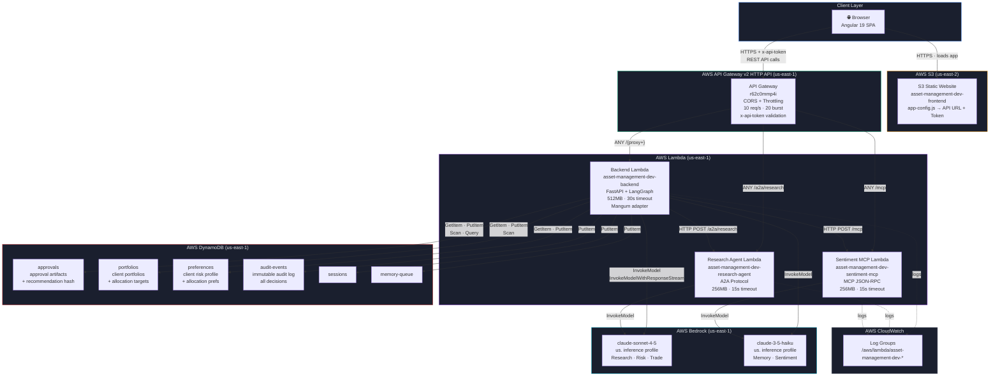
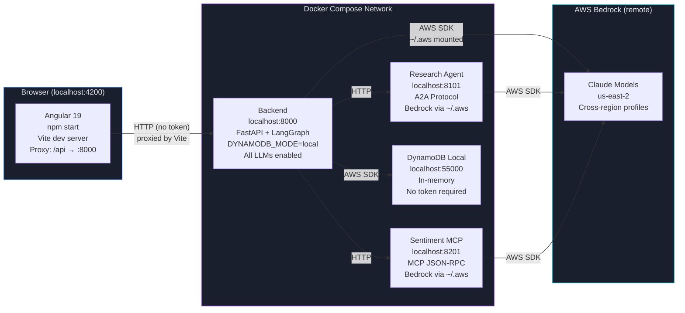
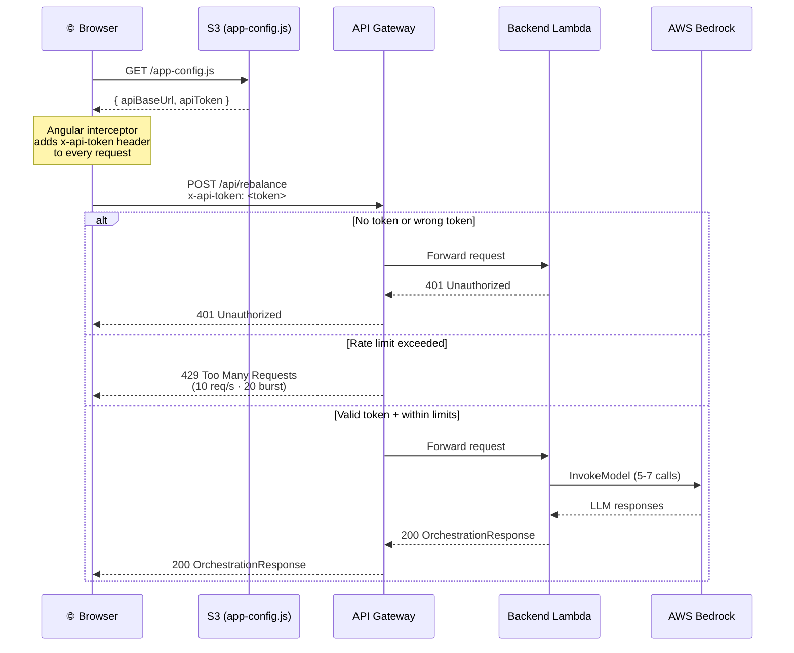

# Architecture Diagrams

## 1. AWS Deployment Architecture

```mermaid
graph TB
    subgraph Client["Client Layer"]
        Browser["🌐 Browser\nAngular 19 SPA"]
    end

    subgraph AWS_S3["AWS S3 (us-east-2)"]
        S3["S3 Static Website\nasset-management-dev-frontend\napp-config.js → API URL + Token"]
    end

    subgraph AWS_APIGW["AWS API Gateway v2 HTTP API (us-east-1)"]
        APIGW["API Gateway\nr62c0mmp4i\nCORS + Throttling\n10 req/s · 20 burst\nx-api-token validation"]
    end

    subgraph AWS_Lambda["AWS Lambda (us-east-1)"]
        BackendLambda["Backend Lambda\nasset-management-dev-backend\nFastAPI + LangGraph\n512MB · 30s timeout\nMangum adapter"]
        ResearchLambda["Research Agent Lambda\nasset-management-dev-research-agent\nA2A Protocol\n256MB · 15s timeout"]
        SentimentLambda["Sentiment MCP Lambda\nasset-management-dev-sentiment-mcp\nMCP JSON-RPC\n256MB · 15s timeout"]
    end

    subgraph AWS_Bedrock["AWS Bedrock (us-east-1)"]
        Claude_Sonnet["claude-sonnet-4-5\nus. inference profile\nResearch · Risk · Trade"]
        Claude_Haiku["claude-3-5-haiku\nus. inference profile\nMemory · Sentiment"]
    end

    subgraph AWS_DynamoDB["AWS DynamoDB (us-east-1)"]
        DB_Approvals["approvals\napproval artifacts\n+ recommendation hash"]
        DB_Portfolios["portfolios\nclient portfolios\n+ allocation targets"]
        DB_Preferences["preferences\nclient risk profile\n+ allocation prefs"]
        DB_Audit["audit-events\nimmutable audit log\nall decisions"]
        DB_Sessions["sessions"]
        DB_Memory["memory-queue"]
    end

    subgraph AWS_CW["AWS CloudWatch"]
        Logs["Log Groups\n/aws/lambda/asset-management-dev-*"]
    end

    Browser -->|"HTTPS · loads app"| S3
    Browser -->|"HTTPS + x-api-token\nREST API calls"| APIGW

    APIGW -->|"ANY /{proxy+}"| BackendLambda
    APIGW -->|"ANY /a2a/research"| ResearchLambda
    APIGW -->|"ANY /mcp"| SentimentLambda

    BackendLambda -->|"InvokeModel\nInvokeModelWithResponseStream"| Claude_Sonnet
    BackendLambda -->|"InvokeModel"| Claude_Haiku
    ResearchLambda -->|"InvokeModel"| Claude_Sonnet
    SentimentLambda -->|"InvokeModel"| Claude_Haiku

    BackendLambda -->|"GetItem · PutItem\nScan · Query"| DB_Approvals
    BackendLambda -->|"GetItem · PutItem\nScan"| DB_Portfolios
    BackendLambda -->|"GetItem · PutItem"| DB_Preferences
    BackendLambda -->|"PutItem"| DB_Audit
    BackendLambda -->|"PutItem"| DB_Sessions
    BackendLambda -->|"PutItem"| DB_Memory

    BackendLambda -->|"HTTP POST /a2a/research"| ResearchLambda
    BackendLambda -->|"HTTP POST /mcp"| SentimentLambda

    BackendLambda -.->|"logs"| Logs
    ResearchLambda -.->|"logs"| Logs
    SentimentLambda -.->|"logs"| Logs

    style Client fill:#1a1f2e,stroke:#3b82f6,color:#e4e7eb
    style AWS_S3 fill:#1a1f2e,stroke:#f59e0b,color:#e4e7eb
    style AWS_APIGW fill:#1a1f2e,stroke:#10b981,color:#e4e7eb
    style AWS_Lambda fill:#1a1f2e,stroke:#a855f7,color:#e4e7eb
    style AWS_Bedrock fill:#1a1f2e,stroke:#06b6d4,color:#e4e7eb
    style AWS_DynamoDB fill:#1a1f2e,stroke:#ef4444,color:#e4e7eb
    style AWS_CW fill:#1a1f2e,stroke:#6b7280,color:#e4e7eb
```

---

## 2. LangGraph Multi-Agent Workflow

```mermaid
flowchart TD
    START(["▶ POST /api/rebalance\nPortfolioRebalanceRequest"])

    subgraph Validation["Validation & Initialization"]
        V1["validate_request\nSchema + business rules\nAllocation sum · Holdings qty"]
        V2["initialize_context_and_trace\nTrace ID · Provider URL"]
        V3["log_request_audit_event\nREQUEST_RECEIVED → DynamoDB"]
    end

    subgraph Parallel["Parallel Execution (fan-out)"]
        P1["hydrate_memory\n🧠 Memory Agent\nLOCAL · LLM-enhanced\nRetrieve client context\nSynthesize preferences"]
        P2["run_research\n🔬 Research Agent\nA2A REMOTE\nMarket regime assessment\nKey insights · Confidence"]
    end

    subgraph Sequential["Sequential Agent Pipeline"]
        S1["run_sentiment_analysis\n📊 Sentiment Agent\nMCP TOOL SERVER\nPer-asset sentiment score\nPOSITIVE/NEGATIVE/NEUTRAL"]
        S2["run_portfolio_rebalancing\n⚖️ Rebalancing Agent\nLOCAL · Deterministic\nDrift calculation\nCurrent vs target allocation"]
        S3["run_risk_policy\n🛡️ Risk & Compliance Agent\nLOCAL · Deterministic\nConcentration check\nPolicy verdict"]
    end

    subgraph PolicyGate["Conditional Route: Policy Verdict"]
        PG{{"verdict?"}}
        PG_COMPLIANT["COMPLIANT\n→ generate trades"]
        PG_BLOCKED["NON_COMPLIANT\nor UNRESOLVED\n→ BLOCKED state"]
    end

    subgraph TradeProposal["Trade Proposal"]
        T1["generate_execution_proposal\n💱 Trade Execution Agent\nLOCAL · Deterministic + LLM\nBUY/SELL per drifted asset\nEstimated value · Rationale"]
    end

    subgraph Assembly["Output Assembly"]
        A1["assemble_recommendation\nMerge all agent outputs\nworkflow_state: NORMAL/DEGRADED/BLOCKED\nSentiment context in summary"]
        A2["apply_output_guardrails\nBedrock Guardrails check\nSensitive content filter"]
    end

    subgraph GuardrailGate["Conditional Route: Guardrails"]
        GG{{"action?"}}
        GG_NONE["NONE\n→ create artifact"]
        GG_BLOCKED["BLOCKED\n→ skip artifact"]
    end

    subgraph HumanLoop["Human-in-the-Loop"]
        H1["create_approval_artifact\n📋 ApprovalArtifact\nRecommendation hash\nPENDING status"]
        H2["persist_workflow_artifacts\nDynamoDB: approvals\nDynamoDB: portfolios"]
        H3["emit_workflow_audit_event\nWORKFLOW_COMPLETED → DynamoDB"]
        H4["return_response\nOrchestrationResponse\n→ Angular UI"]
    end

    subgraph HumanDecision["Human Decision (outside LangGraph)"]
        HD{{"User action?"}}
        HD_APPROVE["APPROVE\nPortfolio updated\nMemory written\nAudit logged"]
        HD_REJECT["REJECT\nNote required\nAudit logged"]
        HD_ACK["ACKNOWLEDGE\n(policy block)\nCleared for retry"]
    end

    START --> V1
    V1 -->|"validation passed"| V2
    V1 -->|"validation failed"| H3
    V2 --> V3
    V3 --> P1
    V3 --> P2
    P1 --> S1
    P2 --> S1
    S1 --> S2
    S2 --> S3
    S3 --> PG
    PG -->|"COMPLIANT"| PG_COMPLIANT
    PG -->|"NON_COMPLIANT\nUNRESOLVED"| PG_BLOCKED
    PG_COMPLIANT --> T1
    PG_BLOCKED --> A1
    T1 --> A1
    A1 --> A2
    A2 --> GG
    GG -->|"NONE"| GG_NONE
    GG -->|"BLOCKED"| GG_BLOCKED
    GG_NONE --> H1
    GG_BLOCKED --> H3
    H1 --> H2
    H2 --> H3
    H3 --> H4
    H4 --> HD
    HD -->|"✓ Approve"| HD_APPROVE
    HD -->|"✗ Reject"| HD_REJECT
    HD -->|"Acknowledge"| HD_ACK

    style START fill:#3b82f6,stroke:#3b82f6,color:white
    style Validation fill:#1a1f2e,stroke:#3b82f6,color:#e4e7eb
    style Parallel fill:#1a1f2e,stroke:#a855f7,color:#e4e7eb
    style Sequential fill:#1a1f2e,stroke:#10b981,color:#e4e7eb
    style PolicyGate fill:#1a1f2e,stroke:#f59e0b,color:#e4e7eb
    style TradeProposal fill:#1a1f2e,stroke:#06b6d4,color:#e4e7eb
    style Assembly fill:#1a1f2e,stroke:#6b7280,color:#e4e7eb
    style GuardrailGate fill:#1a1f2e,stroke:#f59e0b,color:#e4e7eb
    style HumanLoop fill:#1a1f2e,stroke:#10b981,color:#e4e7eb
    style HumanDecision fill:#1a1f2e,stroke:#ef4444,color:#e4e7eb
    style HD_APPROVE fill:#10b981,stroke:#10b981,color:white
    style HD_REJECT fill:#ef4444,stroke:#ef4444,color:white
    style HD_ACK fill:#f59e0b,stroke:#f59e0b,color:#1a1a1a
```

---

## 3. Local Development Architecture

```mermaid
graph LR
    subgraph Browser["Browser (localhost:4200)"]
        Angular["Angular 19\nnpm start\nVite dev server\nProxy: /api → :8000"]
    end

    subgraph Docker["Docker Compose Network"]
        Backend["Backend\nlocalhost:8000\nFastAPI + LangGraph\nDYNAMODB_MODE=local\nAll LLMs enabled"]
        Research["Research Agent\nlocalhost:8101\nA2A Protocol\nBedrock via ~/.aws"]
        Sentiment["Sentiment MCP\nlocalhost:8201\nMCP JSON-RPC\nBedrock via ~/.aws"]
        DynamoDB["DynamoDB Local\nlocalhost:55000\nIn-memory\nNo token required"]
    end

    subgraph AWS_Remote["AWS Bedrock (remote)"]
        Bedrock["Claude Models\nus-east-2\nCross-region profiles"]
    end

    Angular -->|"HTTP (no token)\nproxied by Vite"| Backend
    Backend -->|"HTTP"| Research
    Backend -->|"HTTP"| Sentiment
    Backend -->|"AWS SDK"| DynamoDB
    Backend -->|"AWS SDK\n~/.aws mounted"| Bedrock
    Research -->|"AWS SDK"| Bedrock
    Sentiment -->|"AWS SDK"| Bedrock

    style Browser fill:#1a1f2e,stroke:#3b82f6,color:#e4e7eb
    style Docker fill:#1a1f2e,stroke:#a855f7,color:#e4e7eb
    style AWS_Remote fill:#1a1f2e,stroke:#06b6d4,color:#e4e7eb
```

---

## 4. Security & Rate Limiting

```mermaid
sequenceDiagram
    participant Browser as 🌐 Browser
    participant S3 as S3 (app-config.js)
    participant APIGW as API Gateway
    participant Lambda as Backend Lambda
    participant Bedrock as AWS Bedrock

    Browser->>S3: GET /app-config.js
    S3-->>Browser: { apiBaseUrl, apiToken }

    Note over Browser: Angular interceptor<br/>adds x-api-token header<br/>to every request

    Browser->>APIGW: POST /api/rebalance<br/>x-api-token: <token>

    alt No token or wrong token
        APIGW->>Lambda: Forward request
        Lambda-->>APIGW: 401 Unauthorized
        APIGW-->>Browser: 401 Unauthorized
    else Rate limit exceeded
        APIGW-->>Browser: 429 Too Many Requests<br/>(10 req/s · 20 burst)
    else Valid token + within limits
        APIGW->>Lambda: Forward request
        Lambda->>Bedrock: InvokeModel (5-7 calls)
        Bedrock-->>Lambda: LLM responses
        Lambda-->>APIGW: 200 OrchestrationResponse
        APIGW-->>Browser: 200 OrchestrationResponse
    end
```
